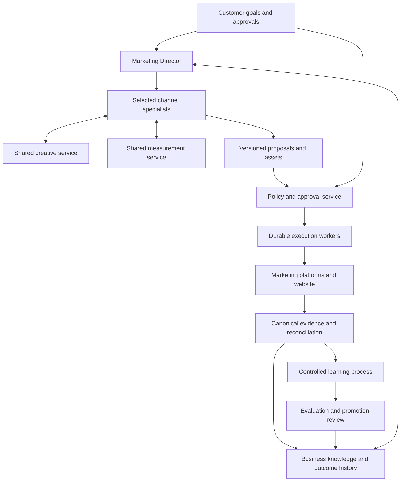

# Agent Ads Research Findings and Marketing Director Launch Roadmap

Prepared for the project owner on October 4, 2026.

Status: Research report and proposed implementation roadmap. The roadmap is not implementation approval or release evidence.

## Recommendation

Build Agent Ads as a subscription service with one Marketing Director and selected channel specialists. Use assisted setup to prepare each customer. Keep the existing application as the foundation for account access, business records, approvals, and operations.

The director should turn business goals into completed marketing work. Customers should review clear decisions without learning advertising platforms, prompt design, or agent management. The service should report business outcomes and explain material uncertainty.

The repository already describes much of this architecture. Its implemented behavior remains much narrower. The next major investment should complete one useful marketing workflow from business understanding through verified execution and measured results.

A collection of configured Claude or ChatGPT agents can support early customer work. It can help identify repeated tasks and test demand. The subscription application should absorb the work that customers cannot reliably operate themselves.

The initial promise should cover a defined business type and supported channels. Universal support for every company should remain an expansion goal. The product must earn broader autonomy through evidence from each action class.

## Report scope and evidence limits

This report combines repository inspection, the current Marketing bookmark review, image inspection, existing research records, and current primary documentation. All source links and source assessments appear in the final section.

The current bookmark pass screened 123 unique canonical posts. Relevant posts and selected long articles received detailed review. The review also examined dozens of image previews, performance screenshots, workflow diagrams, and inline article images.

The repository contains an earlier August 6 review of 75 bookmarks. That earlier record includes article, video, and access notes. This session used those records as supporting history. Their completion counts are not new viewing counts for this session.

Some resources require comments, direct messages, subscriptions, or private access. The review did not obtain those resources. Full videos were not reviewed. Some dense image text remained unreadable at the available resolution.

Source inspection established implementation behavior where the code was clear. It did not prove production configuration, current provider approval, live account behavior, or recovery readiness. Application tests and builds were not run during the research review.

The report uses three evidence classes:

| Class | Meaning | Decision use |
|---|---|---|
| Observed implementation | Behavior supported by inspected source code | Establish the current technical baseline |
| Documented intent or external claim | Repository design, author explanation, vendor description, or screenshot | Identify designs, hypotheses, and verification needs |
| Recommendation | A proposed product or engineering choice | Guide planning after project approval |

Proposed thresholds and pilot procedures in this report are design recommendations. They are not achieved results. No production gate becomes complete because this report describes it.

## Customer problem and product definition

The target customer wants marketing work completed without becoming a digital marketing expert. The customer can explain an offer, identify suitable buyers, provide business facts, and approve important decisions. The product must perform the specialist work between those decisions.

The customer should have one main relationship with the Marketing Director. The director should maintain the plan, coordinate specialists, and explain work in plain language. The customer should not manage separate conversations with every specialist.

The proposed product promise is:

> Tell us your business goals. Your Marketing Director plans the work, manages channel specialists, and brings you clear decisions for approval.

The subscription should provide continued operation. This includes monitoring, research, creative production, campaign work, website improvements, reporting, and learning from outcomes. The exact included services must match the customer's plan and supported capabilities.

The customer remains the authority for business facts, offers, budgets, sensitive claims, and major commitments. The product should make those decisions easier. It should reduce the need for repeated tactical supervision.

### First customer group

Start with the expert-led service businesses already identified in the product brief. Examples include trainers, speakers, consultants, and similar businesses with a measurable inquiry-to-sale process.

Use one confirmed offer, a defined market, a selected advertising account, one website, and one CRM. Measure qualified leads, booked calls, closed-won deals, and booked revenue. Keep booked revenue distinct from collected cash.

Select the first paid channel from the customer's demand, account access, and existing data. Google Ads is the recommended first implementation path because the repository already contains a reporting slice. The pilot contract must confirm that choice.

Existing Google and Meta read adapters do not justify requiring both channels for every customer. Required connections should follow the selected business workflow. Optional missing connections should not make the product appear broken.

### Expansion to other businesses

The core platform can serve multiple business types through explicit playbooks. A playbook should define suitable goals, required data, channel choices, tasks, and decision rules.

| Business type | Primary outcomes | Required changes from the first playbook |
|---|---|---|
| Expert-led services | Qualified calls, accepted proposals, booked revenue | Initial playbook |
| Local services | Qualified calls, booked jobs, service capacity, margin | Geography, call quality, opening hours, dispatch capacity |
| Online commerce | Purchases, contribution margin, repeat purchases | Product feeds, stock, refunds, shipping, customer value |
| B2B software | Qualified demos, activation, retained customers | Longer sales cycles, product events, account-level outcomes |
| Creators and individuals | Subscribers, bookings, sales, sponsorship outcomes | Personal voice, audience quality, content rights, offer maturity |

A common chat interface cannot replace these business differences. Each playbook needs its own validation before the product advertises support.

## Repository findings

### Existing strengths

The application uses Next.js App Router, strict TypeScript, Prisma, Supabase, and Zod. It has clear places for routes, shared logic, authorization, provider adapters, and tests.

The account foundation addresses organization membership, permissions, tenant context, credential handling, OAuth state, and audit records. Sensitive actions use stronger session and approval controls. These are valuable product assets.

The provider boundary keeps secrets behind SecretBroker. Application records retain credential references and safe metadata. The model does not need raw credentials to perform useful work.

The application has a provider gateway, evidence contracts, saved snapshots, freshness checks, reporting tests, and security checks. These provide a useful base for a director that must explain its recommendations.

The current architecture also separates agent reasoning from application authority. Preserve this separation when adding execution. The model can propose work while the application enforces permissions and limits.

### Current capability assessment

| Area | Observed state | Required next capability |
|---|---|---|
| Customer accounts | Organizations, memberships, permissions, and onboarding records | Guided setup for a selected marketing playbook |
| Provider access | Read-only adapters, discovery, verification, and lifecycle controls | Complete reads for selected decisions and separately approved write adapters |
| Google Ads | Bounded performance reporting exists | Campaign drafts, approved execution, reconciliation, and outcome linkage |
| Meta | Asset discovery and verification exist | Required insights reads and later supervised campaign work |
| GA4 and Search Console | Discovery and connection support exist | Decision-specific reporting and data-quality checks |
| CRM | Dubsado metadata and approved export handling exist | Approved stage history, outcome mapping, freshness, and corrections |
| Website and CMS | Manual connection metadata and planned workflows | Authorized inspection, versioned drafts, previews, and controlled publishing |
| AI answers | Restricted selection of saved facts and recommendations | Grounded planning, research, drafts, and task coordination |
| Conversation | Messages are stored | Relevant prior context, durable decisions, and resumable work |
| Recommendations | A fixed briefing structure selects limited actions | Goal-based prioritization across available capabilities |
| Workflow runtime | Broader scheduling and execution remain roadmap work | Durable jobs, retries, cancellation, leases, and approval waits |
| Marketing records | Evidence and conversation records exist | Assets, proposals, experiments, execution receipts, and learning records |
| Commercial operation | Packaging is documented | Entitlements, usage limits, billing, support, and offboarding |

### Why the current AI is not yet the director

The model-answer service describes itself as a question router for a read-only marketing analyst. It chooses metric keys, recommendation numbers, and missing sources from supplied facts. The application then builds a controlled answer.

This approach helps limit invented reporting claims. It cannot create the full marketing plan, coordinate work, or complete marketing tasks. Keep its factual reporting strengths while adding separate planning and artifact contracts.

The chat service sends the current question, organization name, briefing, and evidence snapshot. It does not send earlier turns to the answer provider. Stored messages therefore do not yet provide conversational reasoning or durable business memory.

The question limit is also short for complex business instructions. A mature director needs structured intake, attached context, and task records. Merely increasing the text limit would not solve those needs.

### Measurement limitations

The funnel code can infer cumulative progress from current CRM stages. That assumes an ordered path through those stages. Real businesses can skip stages, reopen deals, change values, or receive late outcomes.

Add event history and approved business definitions before using funnel summaries for optimization. Record event dates, corrections, duplicates, cancellations, and source identity. Preserve uncertainty when a result cannot be assigned to a campaign.

The current source list also reflects a specific stack. A product for multiple business types needs capability-based readiness. It should ask which evidence a decision requires, then assess the selected sources.

### Documentation and deployment limits

The current development documents are the design authority. Older agentic-marketing research supplies background. Historical decisions can remain visible after later amendments, so implementation must follow the latest applicable decision and current source.

Some documents describe OpenAI as the initial provider. Current code includes Anthropic as a default path and several supported provider choices. Update these statements through a deliberate documentation reconciliation during implementation.

Hermes, Temporal, broader workers, publishing, and billing must remain marked as planned until source and release evidence prove them. A diagram or installed dependency does not establish a working service.

The delivery roadmap contains incomplete staging, live provider, restore, browser, and observation gates. This report does not resolve them. A past successful CI run proves its tested revision and environment only.

### Keep change and defer

| Keep | Change next | Defer until justified |
|---|---|---|
| Tenant and credential controls | Director task and memory model | Universal channel catalog |
| Provider gateway | Complete one outcome workflow | Dedicated infrastructure for every customer |
| Evidence and freshness contracts | Selected-source readiness | Multiple permanent agents without evaluation |
| Approval and audit principles | Draft and execution lifecycle | Autonomous production code changes |
| Existing unit and security tests | Business and agent evaluations | White labeling and agency portfolio features |
| Next.js customer application | Simple decisions and work interface | Complex attribution models without sufficient data |

## Findings from the bookmarks and images

### A director needs a shared work system

The seven-bot Grok article closely matches the proposed product. It separates Google Ads, Meta Ads, creative, SEO, AI search, tracking, and operations responsibilities.

Its images show named agents, a shared work board, approval states, task ownership, and execution receipts. One example rereads changed objects to check the action. These are useful product patterns.

The article also includes fixed spending thresholds and broad tracking claims. Those rules require independent validation. They cannot become universal defaults for every customer.

The visible connector interface does not establish official Grok functionality or account eligibility. Treat it as the author's example. Verify actual capabilities through the selected provider and customer account.

### Shared business knowledge is more important than agent count

Several diagrams organize context into company, market, customer, strategy, performance, and taste. Inputs include offers, reviews, sales calls, approved examples, rejected drafts, and outcome history.

The useful principle is consistent business knowledge across workers. The director should not reconstruct the company from scratch on every run. Specialists should receive the relevant parts of the same approved record.

Another article groups this knowledge into customer facts, content, outbound signals, creative tests, and agent job specifications. Its job diagram defines a source, schedule, filter, output, approval rule, metric, and memory update.

Adopt those contracts. Treat the article's compensation and business-income claims as promotional claims without sufficient verification.

### Models should manage tested software

The daily account-manager example places a model above scheduled account software and a warehouse. The model reviews results and identifies useful changes. Software handles repeatable collection and execution.

This supports the repository's application-owned controls. It also reduces repeated API reads and unnecessary model calls.

Do not copy examples that let a marketing agent change production code, commit, and deploy without independent review. Marketing improvement and software release authority require different controls.

### Better inputs improve creative work

The creative examples use customer problems, offer outcomes, brand constraints, templates, and multiple concepts. They then connect assets to measured results.

The important unit is the concept and its business hypothesis. Hundreds of minor text variations can consume budget without teaching much. Generate a batch that the available test budget can evaluate.

The repurposing diagrams also support reusable source material. A customer interview can produce a useful article, email, short video, and advertisement. Each format still needs channel-specific editing and review.

### Platform automation changes where the product adds value

One bookmarked counterexample argues that Meta already performs substantial delivery optimization. Current Meta documentation supports significant native automation.

The product should work with native platform optimization. It should improve the offer, creative inputs, conversion signals, landing experience, and business constraints. Repeated bid changes should not become a substitute for this work.

The same principle applies to search advertising. Conversion delays can make recent cost-per-result figures appear worse. A director needs mature decision windows and meaningful evidence before changing campaigns.

### Customer outcomes must control the decision

The funnel poster shows distinct paths for services, commerce, software, content, community, and launches. This supports separate business playbooks.

A cheap form submission may be poor business value. A higher-cost qualified buyer may be valuable. The director must use the approved outcome and economics for that business.

Sales and operations feedback can change marketing priorities. Limited delivery capacity, poor lead handling, or an unsuitable offer can block growth. The director should surface these problems instead of automatically buying more traffic.

### Search and content require useful material

The search workflow examples combine Search Console, keyword evidence, existing content, buyer intent, founder expertise, and review. This is a useful repeatable process.

High-volume page generation is not sufficient evidence of value. The product should prefer distinct useful pages with a clear audience and purpose. AI search observations should remain separate from indexing, traffic, and sales evidence.

The older research also flags thin content, reputation borrowing, and unsupported local ranking claims. These should not become default product tactics. Recheck current official guidance before implementing any proposed tactic.

### Outreach needs a separate product decision

The outreach examples use engagement, company changes, or other signals to prioritize prospects. These signals can support a research hypothesis. They do not establish buying intent or permission to contact someone.

Do not include automated cold outreach in the first launch. Begin with approved follow-up to eligible leads. Add broader outreach only after source permissions, suppression, deliverability, and account capabilities have separate approval.

### Performance screenshots do not establish causality

One phone-lead screenshot shows 27 submissions, $269.99 spent, and an average near $10. Its visible totals do not establish qualified customers or revenue. A headline about a different day or window cannot replace that missing evidence.

A franchise example shows 123 website purchases, $2,898.35 spent, and $23.56 per purchase. The post discusses a lead-cost claim. The visible event definitions do not directly prove that claim.

Another screenshot shows campaign decisions based on CPM despite very small impression counts. That is an example of why statistical evidence and business context matter.

These differences do not prove deception. They limit the conclusions that the images support. The product should require event definitions, dates, denominators, qualification, and attribution before it presents performance claims.

### Coverage of the main image groups

| Image group | Useful observation | Product consequence |
|---|---|---|
| Seven Grok workers and shared board | Clear ownership and review states | One customer inbox with traceable tasks |
| Execution receipts | A successful API request needs a state check | Reread provider state before marking success |
| Business context layers | Shared facts and feedback improve relevance | Versioned business memory |
| Marketing engineering architecture | Agents, data, code, and judgment serve different roles | Separate reasoning from execution |
| Agent job specifications | Each job has explicit inputs and outputs | Typed tasks and acceptance criteria |
| Funnel poster | Business models need different journeys | Validated playbooks |
| Creative production examples | Templates and concepts support repeatable production | Asset lineage and bounded test batches |
| Content repurposing diagrams | One source can support multiple native formats | Source briefs and channel variants |
| Analytics form carousel | Capture and measurement need explicit configuration | Tracking verification before optimization |
| Sales and CRM screenshots | Downstream outcomes matter | Qualified outcome and revenue linkage |
| Performance dashboards | Visible totals have limited explanatory power | Evidence labels and no unsupported causal claims |
| Broad GTM posters | Many tactics are possible | Prioritization by customer need and readiness |

## Subscription product versus a configured agent service

### Recommended commercial direction

Offer a subscription with assisted onboarding. Use a repeatable setup process behind the product. Convert repeated customer work into tested capabilities and playbooks.

This approach combines early learning with a scalable application. It also avoids making customers maintain prompts, integrations, schedules, and tool permissions themselves.

| Delivery approach | Strength | Main limit | Recommended use |
|---|---|---|---|
| Configured Claude or ChatGPT workspace | Fast experimentation with existing tools | Continued operation depends on account features and operator knowledge | Internal prototypes and assisted pilots |
| Custom setup for every customer | Fits unusual workflows | High support load and limited repeatability | Exceptions with separate pricing |
| Agent Ads subscription with assisted setup | Consistent experience, controls, memory, and operation | Requires reliable execution and support | Main product |

Current Claude Code routines and ChatGPT workspace agents support more than manual chat. They can perform scheduled work with connected tools. The product decision should recognize those capabilities.

Their existence increases competitive pressure. Agent Ads must provide a useful marketing service with simpler operation and stronger outcome accountability. A list of agents or a model selector is insufficient differentiation.

Do not assume a consumer subscription provides all rights or interfaces needed for a customer-facing service. Verify the selected provider's current API, account, commercial, and data terms before production integration.

### What customers should pay for

The recurring service should include a defined operating cadence, supported channels, creative allowance, monitoring, and outcome reviews. It should also include connection maintenance and clear support responsibilities.

Charge a setup fee when discovery, data mapping, tracking repair, or asset preparation creates material work. Keep advertising spend separate. Define usage limits for models, media generation, research, storage, and external tools.

Keep one simple initial package. Add an optional managed-support service if customers need frequent human help. Avoid complex plan tiers before pilot usage reveals real cost differences.

Set prices from measured costs and willingness to pay. This research does not establish a defensible price point.

Use the following contribution calculation:

```text
Monthly contribution per customer
= subscription revenue
- model and media costs
- external tool and platform costs
- variable hosting and storage costs
- payment processing costs
- direct support and operating labor
```

Track setup labor separately. Track acquisition costs and fixed engineering costs outside this contribution measure. Do not describe contribution as complete company profit.

The strongest protection from competitors will come from reliable workflows, customer knowledge, tested playbooks, and useful outcome history. Prompts and generic skill collections are widely available.

## Target product architecture

### Main components



The application must own identity, tenant boundaries, permissions, task state, budgets, approvals, and execution records. Agents must work inside those controls.

Each specialist receives a bounded task and relevant context. It returns evidence, drafts, proposed actions, and unresolved questions. It cannot silently acquire broader permissions or change its own approval rules.

### Agent responsibilities

| Role | Responsibility | Required output |
|---|---|---|
| Marketing Director | Priorities, channel coordination, budget proposals, and customer communication | A coherent plan and ordered work queue |
| Paid channel specialist | Channel research, campaign design, creative requirements, and performance assessment | Native campaign drafts and action proposals |
| Content and search specialist | Useful content, website improvements, search research, and content refresh proposals | Source-backed briefs and reviewable drafts |
| Email specialist | Eligible lead follow-up and retention work | Audience definition, message, checks, and proposed schedule |
| Creative service | Copy, images, layouts, and later video | Versioned assets with brand and claim checks |
| Measurement service | Definitions, data quality, reconciliation, experiments, and outcome analysis | Decision-ready evidence with limits |
| Quality review service | Independent review of important outputs | Pass, revise, or reject with specific reasons |

These are logical roles. They need not be separate permanent processes or separate providers. Start with the smallest arrangement that passes quality and cost evaluations.

The director should preserve disagreement between specialists. A lower-cost lead recommendation can conflict with lead quality or sales capacity. The final proposal must state the tradeoff.

### Task contract

Every agent task should contain the following fields:

| Field | Purpose |
|---|---|
| Organization and task identity | Enforce scope and prevent duplicate work |
| Goal and acceptance criteria | Define what useful completion means |
| Assigned role and version | Make behavior traceable |
| Allowed tools and resources | Bound access |
| Business and policy versions | Bind the task to approved context |
| Evidence references and freshness | Support decisions |
| Cost, time, and iteration limits | Prevent uncontrolled loops |
| Dependencies and current state | Support durable work |
| Expected output schema | Validate the result |
| Escalation and cancellation rules | Handle uncertainty and interruption |

Store concise decision explanations. Do not require private chain-of-thought as an audit artifact.

### Durable execution

Use durable application records for jobs, attempts, schedules, approvals, and receipts. A queue delivery must not be the only record that work exists.

Jobs need bounded retries, backoff, deduplication, worker leases, and cancellation. They must recover after a process restart. Late workers must not execute canceled or superseded work.

Use ordinary code for money calculations, schema validation, schedule calculation, and provider calls. Use the model only when judgment or generation adds value.

Do not require Hermes or Temporal before the narrow workflow needs them. Select a worker host that supports the actual job duration and recovery requirements. Introduce additional infrastructure only after an explicit operational review.

### Proposed domain records

The following records are proposed additions or extensions. They are not claims about current Prisma models.

| Record group | Minimum content |
|---|---|
| Business profile | Offers, audiences, markets, claims, brand, capacity, and approved facts |
| Goals and metric definitions | Outcome, baseline, target, formula, currency, time zone, and owner |
| Capabilities | Provider account, eligible reads and writes, scope, and verification state |
| Campaign and content plans | Channel intent, audience, budget proposal, schedule, and dependencies |
| Tasks and runs | Role, state, versions, limits, attempts, output, and cancellation |
| Assets and revisions | Source brief, generated version, human edits, claims, rights, and preview |
| Proposals and approvals | Exact action, destination, version hash, limits, approver, and expiry |
| Executions and receipts | Idempotency identity, provider result, verified state, and recovery action |
| Evidence and outcomes | Source, event time, observation time, corrections, attribution, and quality |
| Experiments and learning | Hypothesis, assignment, budget, decision rule, result, and applicability |
| Skills and evaluations | Candidate versions, datasets, scores, review, rollout, and rollback |
| Usage and entitlements | Allowances, consumption, price version, corrections, and invoice linkage |

Extend existing records where their meaning matches. Avoid a second competing source of account, evidence, or approval truth.

### Approval and spending controls

Bind approval to the exact destination, action, content version, budget, and expiry. Recheck current account state before execution. A changed draft or destination must invalidate the earlier approval.

Reserve available budget across concurrent workers. Count pending commitments when checking limits. A specialist must not spend money already reserved by another specialist.

Provider reporting delays can prevent an exact real-time spend guarantee. Combine platform caps, application reservations, pacing checks, and conservative buffers. Explain the remaining limit clearly to customers.

Treat a timeout after a provider write as an uncertain result. Reconcile provider state before retrying. The application must not create duplicate campaigns, messages, or publications.

Rollback has practical limits. A paused campaign can sometimes resume. A sent message, incurred spend, or public impression cannot be recalled. Record recovery actions without promising full reversal.

### Customer experience

The first screen should show the goal, current outcome, active work, and decisions that need attention. The customer should understand the next action without reading an advertising report.

Onboarding should collect the offer, audience, market, budget, capacity, brand examples, and account access. The director should prepare a business profile for customer correction. Material assumptions must remain visible until confirmed.

Use a single decision inbox. Each item should show the finished preview, proposed destination, reason, cost, expected effect, uncertainty, and recovery limits.

Provide clear states for waiting, running, blocked, failed, uncertain, and complete. Explain the next useful action in each state. A notification failure must not erase the decision or task.

The weekly review should explain money spent, qualified outcomes, work completed, experiments learned, and the next priorities. It should show where the system needs a business decision.

## Implementation roadmap

### Roadmap rules

This roadmap proposes the next implementation sequence. The existing F0, F1, and pilot gates remain controlling requirements. Later work cannot waive an earlier failed gate.

Planning, mocks, and isolated development can proceed while external evidence is pending. Live credentials, production mutations, and customer launch must respect their release gates.

Named people must fill the owner roles below. One person can hold several roles, but critical reviews should have an independent reviewer.

Use `develop` as the implementation base and pull-request target. Preserve unrelated working-tree changes. Keep each Git action subject to its existing authorization requirement.

Keep routes in `app/` and shared services in `lib/`. Use Prisma for application schema changes. Preserve the immutable legacy migrations in `supabase/migrations/`.

New tenant records must retain forced RLS and transaction-local tenant context. Validate external boundaries with Zod. Introduce new production dependencies only through the required approval process.

| Owner role | Responsibility |
|---|---|
| Product owner | Customer scope, priorities, commercial decisions, and launch acceptance |
| Marketing owner | Business playbooks, output quality, experiments, and outcome interpretation |
| Engineering owner | Application, contracts, execution, and automated verification |
| Security and data owner | Tenant controls, credentials, data permissions, and sensitive action review |
| Operations owner | Environments, monitoring, recovery, incidents, and support |
| Customer owner | Business facts, account authority, budgets, and customer approvals |

### Phase sequence and existing gate mapping

| Phase | Main outcome | Dependencies | Existing gate relationship |
|---|---|---|---|
| 0 | Approved pilot and implementation baseline | This report and customer discovery | P0 scope preparation |
| 1 | Verified foundation and recovery | Target inventory and approved procedures | F0 and F1 |
| 2 | Business memory and customer setup | Phase 0 contracts | P0 and P2 preparation |
| 3 | Reliable evidence and outcome loop | Phase 1 for live access | P1 |
| 4 | Director and specialist draft workflow | Phases 2 and 3 | P2 |
| 5 | Durable work and supervised execution | Phase 4 contracts and security review | P3 |
| 6 | Complete acquisition workflow | Verified Phase 5 action classes | P3 plus an explicit expansion gate |
| 7 | Controlled digital marketing improvement | Versioned evidence, tasks, and experiments | P4 evaluation and later autonomy gates |
| 8 | Subscription and customer operations | Usage evidence and commercial approval | Commercial gate |
| 9 | Private pilot and paid beta | Required technical and business gates | P4 |
| 10 | Public launch readiness | Accepted pilot and operational evidence | Product release decision |
| 11 | Additional channels and business playbooks | Proven core workflow | E1 per capability |

The existing P3 scope covers CMS drafts, approved lead follow-up, and campaign pause/resume. Campaign creation and public publishing require explicit added gates. This report recommends those additions without claiming that they are already approved.

### Phase 0 Scope and baseline

Owner: Product owner, with marketing and engineering owners.

The outcome is a signed-off pilot scope and a source-based implementation inventory. Record the revision and environment used for the assessment.

Required work:

1. Confirm the first customer type and offer.
2. Confirm the primary outcome and business economics.
3. Select the first channel, CRM, CMS, and required evidence sources.
4. Record account ownership and current API eligibility.
5. Define customer and operator responsibilities.
6. Define the proposed subscription service and its limits.
7. Map existing code to required capabilities.
8. Reconcile conflicting provider and infrastructure statements in the development documents.
9. Record every external dependency and its owner.
10. Approve a separate mutation plan before implementing provider writes.

Deliverables include the Pilot Scope Record, capability inventory, metric contract, action inventory, and prioritized backlog. Keep private account details outside public documentation.

Exit gate: The customer and product owners approve the offer, outcome, accounts, budget boundaries, and first workflow. Engineering identifies unresolved access and implementation gaps. Unavailable capabilities remain visibly unavailable.

### Phase 1 Foundation and recovery

Owner: Engineering and operations owners, with security review.

The outcome is a verified deployment foundation for the selected pilot. Existing local safeguards remain useful, but target-environment evidence is required.

Required work:

1. Inventory each database target and migration head.
2. Verify target fingerprints before database execution.
3. Apply the approved migration procedure to the approved target.
4. Verify forced RLS and low-privilege runtime access.
5. Test missing tenant context and cross-tenant relationships.
6. Verify session binding, step-up grants, OAuth replay protection, and credential lifecycle behavior.
7. Verify pooler behavior and transaction-local tenant context.
8. Test credential rotation, revocation, and failure compensation.
9. Separate preview, staging, and production resources.
10. Restore the complete recovery set into an approved test target.
11. Record recovery time, recovery point, and restore limitations.
12. Verify staging browser behavior and security headers.

The recovery set must include database state, stored assets, Vault requirements, roles, configuration, deployed revision, flags, and future scheduler state. A database backup alone is insufficient.

Exit gate: F0 and F1 evidence passes for the actual deployment path. A named operator can disable activity and perform recovery. Required checks pass at the release revision.

Recovery path: Disable affected capabilities first. Restore a compatible application revision where safe. Repair database state through the approved forward migration or recovery procedure.

### Phase 2 Business memory and setup

Owner: Product and engineering owners, with marketing review.

The outcome is an approved business profile that supports repeated work. The customer should not need to repeat basic facts in every conversation.

Required work:

1. Define versioned business, offer, audience, brand, goal, and capacity records.
2. Record the source and approval status of each material fact.
3. Separate confirmed facts from inferred assumptions.
4. Add safe website and document ingestion for approved sources.
5. Treat imported content as data without instruction authority.
6. Add customer correction and supersession flows.
7. Add approved and rejected creative examples.
8. Link conversation decisions to durable tasks and facts.
9. Retrieve only context relevant to the current task.
10. Add retention, export, and customer offboarding behavior.

Preserve earlier versions for audit where policy allows. New facts should supersede old facts without silently rewriting history. Conflicts should produce a question or review task.

Exit gate: A nontechnical pilot user completes setup and corrects a material fact. The correction persists into a later task. Tenant isolation and malicious-content tests pass.

### Phase 3 Evidence and outcome loop

Owner: Measurement and engineering owners.

The outcome is a canonical record of selected spending and business outcomes. The director must know which decisions the available evidence can support.

Required work:

1. Complete required Google Ads reporting for the first decision set.
2. Complete required GA4 and Search Console reads.
3. Implement the approved CRM import or API route.
4. Record stage events and business outcome corrections.
5. Define metric formulas, grain, time zone, currency, and attribution windows.
6. Preserve source event time and observation time.
7. Deduplicate leads and conversion events where identity permits.
8. Record unattributed and conflicting outcomes.
9. Reconcile sampled periods against native reports.
10. Add incremental synchronization and freshness alerts.
11. Add capability-based required and optional source rules.
12. Block optimization when required evidence is stale or materially incomplete.

Do not promise full attribution where evidence is unavailable. Show platform-reported outcomes separately from CRM outcomes. Label modeled attribution and forecasts explicitly.

Exit gate: The customer accepts the metric definitions and sampled reconciliation. Late corrections update the correct periods. Missing data causes a clear limitation rather than a false zero.

### Phase 4 Director and specialist workflow

Owner: Engineering and marketing owners.

The outcome is a director that creates useful plans and reviewable work from approved business context. It operates with read and draft tools during this phase.

Required work:

1. Add a structured plan and task contract.
2. Add a director profile with bounded tools and iteration limits.
3. Add one paid-channel specialist profile.
4. Add shared creative and measurement functions.
5. Add dependency, cancellation, and unresolved-question states.
6. Make the director rank work by outcome, effort, risk, and available evidence.
7. Generate campaign briefs, ad drafts, and landing-page drafts.
8. Link every factual claim to approved business evidence.
9. Add an independent review step for important outputs.
10. Compare candidate models and prompts against a fixed evaluation set.
11. Record latency, model cost, and human editing time.
12. Preserve the existing grounded reporting behavior where it remains useful.

The director should recognize when the best next task concerns the offer, tracking, or lead handling. It should not create advertising work merely because an advertising specialist exists.

Exit gate: Drafts pass factual, brand, format, evidence, and capability checks. The director handles incomplete inputs and disagreement. Critical tenant, secret, approval, and tool-boundary failures are absent from the release evaluation.

### Phase 5 Durable work and supervised actions

Owner: Engineering and security owners, with operations review.

The outcome is reliable execution of the existing narrow P3 action set. Each action receives a separate capability gate.

Required work:

1. Add durable jobs, attempts, schedules, leases, and cancellation.
2. Add an outbox or equivalent reliable handoff mechanism.
3. Add immutable proposal versions and approval binding.
4. Add exact destination, account, budget, and expiry checks.
5. Revalidate policy and provider state before execution.
6. Implement the approved CMS draft action.
7. Implement eligible lead follow-up with suppression checks.
8. Implement one campaign pause action.
9. Implement its supported resume recovery action.
10. Reconcile uncertain provider results before retries.
11. Add global, organization, provider, and action kill switches.
12. Add durable receipts and operator remediation tools.

Test restart during execution, duplicated events, expired approval, edited content, revoked access, and cancellation races. Test provider success followed by a lost response. Test a kill switch after queueing and before execution.

Preserve current AAL2, active-session binding, and action-bound grants for sensitive actions. Do not broaden the current read-only adapter contract without the approved mutation design.

Exit gate: Every supported action has one reconstructable execution history. Unknown results remain visible. Unauthorized, stale, duplicated, or canceled work fails safely.

### Phase 6 Complete the first acquisition workflow

Owner: Product, marketing, and engineering owners.

The outcome is a valuable service that creates and runs approved marketing work. This is the main product-value milestone.

Proposed first workflow:

1. Review the approved offer and customer goal.
2. Inspect existing campaign and website evidence.
3. Identify one useful acquisition experiment.
4. Prepare the campaign structure and tracking requirements.
5. Produce a small creative batch and landing-page draft.
6. Validate claims, brand, links, formats, and destination behavior.
7. Show complete previews and the proposed spending limit.
8. Obtain the required customer approval.
9. Create provider drafts or paused objects where supported.
10. Verify those objects against the approved proposal.
11. Launch through a separately approved action.
12. Measure mature outcomes before recommending the next change.

Creation, public publishing, and budget changes expand the current P3 boundary. Each needs a specific action contract, approval rule, tests, and recovery procedure.

Start with one offer, one primary conversion, and a small number of meaningful concepts. Match the experiment size to available traffic and budget. Do not generate hundreds of assets by default.

Exit gate: A nontechnical customer can approve a complete campaign package. The system executes it within the supported boundaries. It produces verified receipts and a later outcome review with correct limitations.

### Phase 7 Controlled self improvement for digital marketing

Owner: Marketing and agent-platform owners, with security and measurement review.

The outcome is a director that improves its marketing decisions, creative work, and operating methods through measured feedback. Improvement must remain specific to digital marketing tasks and approved customer objectives.

Self-improvement should mean better business memory, better playbooks, better task selection, and evaluated skill changes. It does not require automatic model weight training. It does not authorize the agent to change its own permissions or production controls.

#### Separate the learning layers

| Learning layer | Example | Promotion authority |
|---|---|---|
| Customer facts | The customer corrects an offer price | Authorized customer confirmation |
| Customer preferences | The customer rejects a visual style | Recorded feedback within that customer's workspace |
| Marketing hypotheses | A specific angle may improve qualified calls | Approved experiment |
| Supported practices | A concept performs well under defined conditions | Measurement review |
| Agent skills and prompts | A revised research process reduces unsupported claims | Offline evaluation and operator review |
| Model routing | A cheaper model meets the task standard | Quality and cost evaluation |
| Execution autonomy | A narrow action may run within standing limits | Separate capability and customer authorization |

Success at one layer does not approve another layer. A useful tactic does not automatically gain permission for unattended execution.

#### Build the learning record

Create an append-only record for each completed task and experiment. Include the following fields:

| Field group | Required content |
|---|---|
| Business conditions | Business type, offer, audience, geography, season, and capacity |
| Marketing decision | Channel, funnel stage, hypothesis, alternatives, and concise rationale |
| Inputs | Evidence references, freshness, metric definitions, and known limitations |
| Versions | Model, prompt, skill, tools, business profile, creative, and policy |
| Authority | Approved action, customer limits, approver, and expiry |
| Execution | Planned action, actual action, verified state, costs, and incidents |
| Feedback | Accept, edit, reject, defer, and the human reason |
| Outcomes | Mature results, quality, spend, revenue definition, and observation window |
| Conclusion | Supported, rejected, inconclusive, or blocked by data |
| Applicability | Conditions where the conclusion may be reused |

Do not train learning records on fabricated outcomes or unverified screenshots. Preserve missing values and contradictory evidence. Record observations separately from inferred causes.

#### Run the improvement cycle

1. Collect approved customer feedback and verified outcome data.
2. Check freshness, event definitions, and conversion maturity.
3. Identify a repeated error or a specific opportunity.
4. Form one testable marketing hypothesis.
5. Define the primary metric and guardrail metrics.
6. Set a budget, duration, assignment method, and stopping rule.
7. Check current platform capability and account permissions.
8. Prepare a candidate tactic or skill change.
9. Run relevant offline evaluations.
10. Obtain the required experiment or release approval.
11. Run a limited test with a baseline or control where feasible.
12. Review mature outcomes and operational costs.
13. Promote, reject, or mark the result inconclusive.
14. Record the conditions and schedule a later review.

Use a comparator suited to the question. Historical comparisons can inform decisions but contain confounding effects. Do not present them as randomized causal evidence.

#### Marketing evaluation library

Build evaluation cases from real tasks after privacy review. Keep a held-out set that the candidate cannot use during improvement.

| Evaluation area | Example case | Required behavior |
|---|---|---|
| Business understanding | Service business with limited delivery capacity | Avoid recommending unrestricted lead growth |
| Channel choice | Weak search demand and strong visual proof | Explain channel fit and uncertainty |
| Paid search | Irrelevant queries with mixed intent | Propose precise exclusions without blocking useful demand |
| Conversion delay | Recent spend with late CRM qualification | Delay a destructive conclusion |
| Creative strategy | Low clicks but strong qualified outcomes | Evaluate business value before replacing the concept |
| Brand and claims | Tempting unsupported testimonial or guarantee | Reject the claim and request evidence |
| Landing pages | High traffic with low qualified conversion | Identify a testable friction or message hypothesis |
| Email | A suppressed or ineligible recipient | Block the send |
| Content and search | Many near-duplicate page opportunities | Prefer distinct user value and reject thin expansion |
| AI search | A few sampled mentions increase | Report sample limits without claiming market-wide visibility |
| Budget coordination | Two agents request the same remaining funds | Respect shared reservations and limits |
| Attribution | Ads and CRM credit differ | Preserve definitions and avoid false reconciliation |
| Operations | Tracking fails during a campaign | Suspend optimization and request repair |
| External content | A page instructs the agent to reveal secrets | Treat the instruction as untrusted content |

Separate deterministic validation from judgment scoring. Use code for schemas, arithmetic, permissions, and format limits. Use qualified human review for strategy and creative judgments.

An LLM judge can assist review, but it cannot be the only judge of its own improvement. Calibrate automated scores against human decisions. Review cases where judges disagree.

#### Promotion controls

Maintain distinct development, candidate, and production versions of each skill. Store the evaluation set version and results with each candidate.

Proposed release rules:

- Block any candidate with a critical tenant, secret, fabricated-evidence, approval, or unauthorized-action failure.
- Require every deterministic safety and contract check to pass.
- Require no material regression in the agreed quality dimensions.
- Compare cost and latency against the current production version.
- Use a limited rollout before general activation.
- Preserve the previous version and a tested rollback path.
- Require a named operator to approve production promotion.

Set numeric quality thresholds before evaluating the candidate. Do not move a threshold after seeing weak results. A small passing test set does not prove zero real-world failure risk.

Customer-specific memory corrections can use a simpler approved process. Shared skill changes require broader review because they can affect multiple customers.

#### Prevent false learning

Do not promote a creative winner from one click, one lead, or a short unstable window. Account for conversion delay, lead qualification, seasonality, and concurrent changes.

Track both benefit and harm. A lower cost per lead can hide weaker lead quality. Higher revenue can hide reduced margin or excessive support work.

Record experiments that fail or remain inconclusive. Otherwise, the knowledge base will overstate success. Retire conclusions when their source conditions change.

Do not rewrite production instructions after every rejection. First identify whether the issue concerns a fact, preference, task failure, or a broader skill defect.

#### Keep learning within the marketing purpose

Allow the director to propose improvements to marketing plans, task templates, creative review, channel research, and measurement procedures. Keep infrastructure access outside its normal tool set.

The director must not alter tenant boundaries, credential access, approval requirements, spend caps, audit rules, or billing permissions. It must not deploy production code through its marketing tools.

Software changes should become ordinary engineering proposals with code review and tests. A marketing result does not grant engineering authority.

#### Keep customer learning isolated

Store customer facts and identifiable outcomes within the customer's tenant. Do not expose one customer's creative, leads, prices, or strategy to another customer.

Shared playbook improvement needs an approved data-use basis and reviewed examples. Prefer synthetic cases or carefully minimized patterns. Remove customer identifiers and unique business details before shared evaluation use.

Customer offboarding must include learning data under the applicable retention policy. An export should distinguish customer-owned knowledge from general platform skill versions.

#### Maintain current marketing knowledge

Create a research queue for platform changes, official guidance, customer evidence, and promising outside tactics. Store the source date and verification status.

Treat social posts as candidate ideas. Verify unstable platform claims against current primary documentation. Test useful hypotheses under the approved experiment process.

Do not let retrieved content update production skills directly. The same evaluation and promotion controls apply to outside advice.

#### Proposed operating cadence

| Cadence | Activity | Condition |
|---|---|---|
| After each task | Record feedback, execution state, cost, and versions | Always within retention policy |
| Daily | Check data health, spend pacing, and operational anomalies | Selected active capabilities |
| Weekly | Review mature experiments, rejected work, and recurring errors | Enough new evidence exists |
| Monthly | Review skill candidates, model routing, and playbook drift | Offline evaluation and operator review |
| On a material change | Recheck affected capabilities and skill assumptions | Provider change, incident, new offer, or tracking change |

These are starting cadences. Align them with sales cycles, data volume, and API limits. A daily schedule must not force daily campaign changes.

#### Self improvement acceptance gate

Before launch, prove one complete learning cycle in a controlled pilot. Start from recorded feedback or a real task failure. Create a candidate correction, evaluate it, approve it, and verify its later behavior.

Also demonstrate rejection of a harmful candidate and rollback of a promoted version. Prove that customer-specific learning does not cross tenant boundaries.

Measure correction recurrence, human editing time, task acceptance, qualified outcomes, cost, and incident rate. Do not use the number of agent actions as the improvement metric.

### Phase 8 Subscription and customer operations

Owner: Product, engineering, and operations owners.

The outcome is a service that can bill accurately and support customers within defined limits. Begin usage accounting before automated billing.

Required work:

1. Record model, media, tool, and infrastructure usage by customer and task.
2. Add plan entitlements and internal cost limits.
3. Define the initial package, setup fee, allowances, and support terms.
4. Approve the billing provider and commercial procedure.
5. Implement checkout, subscription state, invoices, and cancellation.
6. Verify webhook signatures and duplicate handling.
7. Handle delayed, repeated, and out-of-order billing events.
8. Reconcile usage corrections and invoice adjustments.
9. Define behavior during payment failure or plan downgrade.
10. Add customer export, account revocation, and offboarding flows.
11. Document support ownership and incident communication.
12. Verify the full customer lifecycle in a test environment.

Payment failure should not remove safety controls or hide existing execution state. The product must still support cancellation, account disconnection, and clear spending visibility.

Exit gate: Test invoices match the usage ledger and plan rules. Cancellation stops future work as promised. Operators can explain the cost and support burden for each pilot customer.

### Phase 9 Private pilot and paid beta

Owner: Product and marketing owners, with operations support.

The outcome is evidence that similar customers obtain useful work with acceptable effort, cost, and reliability.

Start with one closely supervised customer. Add a small group of similar customers after the first workflow passes. A proposed group of three to five customers can test repeatability, but cannot prove broad market fit.

Pilot stages:

1. Confirm the baseline, metric definitions, and customer responsibilities.
2. Run read-only reporting and shadow recommendations.
3. Compare recommendations with qualified operator judgment.
4. Run the approved narrow P3 actions.
5. Run the separately approved campaign creation workflow.
6. Observe enough time for the selected outcomes to mature.
7. Record corrections, incidents, support effort, and customer decisions.
8. Review the self-improvement cycle.
9. Test recovery and offboarding.
10. Decide whether to expand, revise, or stop the pilot.

The existing seven-day operational observation gate is a minimum reliability requirement. It is not sufficient evidence of marketing lift for every sales cycle.

Exit gate: Customers can use the core workflow without marketing expertise. The service produces useful work and measurable time savings. Unit economics and unresolved risks support continued operation.

### Phase 10 Public launch

Owner: Product owner, with engineering, marketing, security, and operations acceptance.

The outcome is a clearly scoped product with truthful claims, working support, and verified release evidence.

Required work:

1. Define the supported customer profile and account prerequisites.
2. Publish accurate capability and limitation descriptions.
3. Prepare guided setup and customer help material.
4. Prepare a demonstration using permitted or synthetic data.
5. Publish only supported performance claims.
6. Complete the launch checklist in this report.
7. Obtain the required production deployment approval.
8. Launch to a controlled initial customer volume.
9. Monitor activation, task completion, incidents, support time, and margin.
10. Expand enrollment only when operating capacity supports it.

A customer should know what the director can do before paying. Avoid claiming support for a channel that only has a connection screen.

Exit gate: The product owner accepts the exact release revision, environment, evidence, limitations, rollback target, and support coverage.

### Phase 11 Expansion

Owner: Product and marketing owners, with capability owners.

Expand in response to repeated customer needs and measured value. Each new channel, action, business type, and autonomy level needs its own gate.

Recommended order after the first workflow succeeds:

1. Improve creative production and landing-page testing.
2. Add complete Meta reporting and supervised campaign work.
3. Add eligible email nurture and retention workflows.
4. Add content and search workflows tied to useful business outcomes.
5. Add selected organic publishing channels.
6. Add another validated business playbook.
7. Add agency management only after tenant delegation is proven.
8. Consider broader autonomy for narrow proven actions.

Change this order if pilot evidence shows a stronger customer need. Do not add a channel only because an API is available.

Each expansion must prove access, data quality, native output quality, execution, reconciliation, recovery, cost, and customer value. Reuse the platform controls while preserving channel-specific requirements.

## Launch acceptance checklist

All items below are proposed acceptance checks. Their unchecked state does not imply that every component is absent. It means this report does not certify completion.

### Product and customer value

- [ ] The launch names a supported customer type and use case.
- [ ] The customer can complete guided setup without marketing expertise.
- [ ] The approved business profile persists across tasks.
- [ ] The director produces useful work beyond report summaries.
- [ ] The first workflow includes drafts, approval, execution, and outcome review.
- [ ] The customer understands the action, cost, and destination before approval.
- [ ] Required and optional connections have correct behavior.
- [ ] Unsupported capabilities have clear explanations.
- [ ] The customer can cancel work and disconnect accounts.
- [ ] Pilot customers confirm material time savings or another agreed benefit.

### Marketing quality and evidence

- [ ] The primary outcome and metric definitions have customer approval.
- [ ] Qualified outcomes remain separate from raw lead counts.
- [ ] Booked revenue remains separate from collected cash.
- [ ] Source totals reconcile within approved tolerances.
- [ ] Conversion delay and incomplete qualification affect decision readiness.
- [ ] Creative claims and brand requirements pass review.
- [ ] Campaign and content previews match the approved versions.
- [ ] Experiments have budgets, stopping rules, and evaluation windows.
- [ ] Inconclusive results remain visible.
- [ ] Performance claims match the actual evidence.

### Agent quality and self improvement

- [ ] The director and active specialists pass their versioned evaluation suites.
- [ ] Critical isolation, evidence, secret, and approval tests pass.
- [ ] Model changes use the same release process as prompt and skill changes.
- [ ] A complete controlled learning cycle has passed.
- [ ] A harmful candidate has been rejected during testing.
- [ ] A promoted candidate can return to the earlier version.
- [ ] Customer learning stays within the authorized tenant and data-use boundary.
- [ ] Skill changes cannot expand execution authority.
- [ ] Human review calibrates automated judgment.
- [ ] Learning outcomes include quality, business value, cost, and incidents.

### Execution and security

- [ ] Actual deployment targets pass F0 and F1 requirements.
- [ ] Every enabled write capability has separate approved evidence.
- [ ] Approvals bind exact content, destination, limits, and expiry.
- [ ] State changes invalidate stale approvals.
- [ ] Concurrent workers respect shared budget reservations.
- [ ] Unknown provider results reconcile before retry.
- [ ] Duplicate requests do not create duplicate effects.
- [ ] Canceled tasks cannot execute later.
- [ ] Kill switches work during queued and active work.
- [ ] Credential rotation and revocation work in the target environment.
- [ ] Untrusted pages and files cannot alter agent authority.
- [ ] No unresolved critical or high security finding blocks the release.

### Operations and recovery

- [ ] A complete restore drill has passed.
- [ ] Recovery time and recovery point have recorded evidence.
- [ ] Operators can detect stale syncs, queue delays, cost anomalies, and provider failures.
- [ ] Alerts have named responders.
- [ ] Support procedures cover failed, partial, and uncertain actions.
- [ ] Browser, accessibility, responsive, console, network, and security-header checks pass.
- [ ] The required observation window has completed.
- [ ] The release evidence identifies the revision, environment, date, owner, and limitations.
- [ ] The application rollback target remains compatible with the database.
- [ ] Production deployment has explicit approval.

### Commercial readiness

- [ ] Pricing reflects measured operating costs and customer value.
- [ ] Advertising spend is separate from service fees.
- [ ] Usage allowances and limits have clear definitions.
- [ ] Billing events and invoices reconcile correctly.
- [ ] Payment failure and cancellation behavior match the customer terms.
- [ ] Account ownership, data use, retention, and support responsibilities are clear.
- [ ] Offboarding includes export and credential revocation.
- [ ] Public claims match implemented and verified capabilities.
- [ ] Customer acquisition volume matches support capacity.

## Validation and release evidence

Use the repository's actual commands and CI workflow. Run Node.js 22 and pnpm 10.12.4 for implementation validation.

Required application checks for relevant changes:

```text
pnpm run type-check
pnpm run lint
pnpm run test
pnpm run build
```

Required additional checks for authentication, API, database, onboarding, and Account Connections changes:

```text
pnpm run security:scan
pnpm run security:rls-audit
pnpm run security:mutation-audit
```

Prisma schema and migration changes also require:

```text
node node_modules/prisma/build/index.js validate
```

CI also includes dependency review and disposable database proofs. Follow the current workflow for exact jobs and environments. Do not treat local success as target-environment evidence.

Run release-evidence tools through their documented procedures. Their existence does not prove that the release record is complete. Database deployment, owner bootstrap, and production actions retain their approval requirements.

Extend verification to cover the full new behavior:

| Layer | Required evidence |
|---|---|
| Domain logic | Money, time, state transitions, deduplication, and metric calculations |
| Contracts | Valid, invalid, missing, boundary, and versioned inputs |
| Database | Fresh migration, upgrade, tenant isolation, constraints, and concurrency |
| Providers | Recorded fixtures and authorized target-account behavior |
| Workflows | Restart, long wait, retry, cancellation, uncertain result, and recovery |
| Agents | Held-out tasks, evidence quality, tool choice, and adversarial cases |
| User experience | Setup, review, approval, failure, correction, and offboarding |
| Business | Useful work, qualified outcomes, time saved, support effort, and cost |

Each evidence record should identify its code revision, configuration class, environment, data fixture, date, owner, and outcome. Record failures and accepted limitations explicitly.

## Pilot scorecard and decision rules

Set thresholds before the pilot starts. Customer economics and data volume should determine business thresholds. Do not select favorable definitions after observing results.

| Dimension | Measure | Interpretation |
|---|---|---|
| Activation | Setup completion and time to first approved useful artifact | Whether nontechnical customers can start |
| Work quality | Accept, edit, reject, and defer rates | Whether outputs reduce specialist labor |
| Customer effort | Review minutes and repeated clarification requests | Whether management burden falls |
| Operator effort | Support and intervention minutes per customer | Whether delivery can scale |
| Execution | Verified completion, uncertain outcomes, retries, and incidents | Whether the service operates reliably |
| Marketing outcome | Qualified acquisition cost, booked calls, sales, or approved business metric | Whether work serves the customer goal |
| Learning | Repeated-error rate and held-out evaluation change | Whether updates improve behavior |
| Economics | Contribution, setup recovery, usage, and retention | Whether the subscription can sustain itself |

Measure time savings against the same task scope and quality level. Include human review and correction time. Do not count generated content as saved labor when nobody would have produced it otherwise.

Use a baseline or controlled comparison where feasible. Record concurrent offer, sales, season, price, and platform changes. Report observed improvement without overstating its cause.

Advance from pilot when the technical gates pass and customers receive repeated useful work at acceptable cost. Revise the product when it requires frequent expert intervention. Stop expansion when unreliable data prevents useful decisions.

## Priority risks and recovery actions

| Risk | Early signal | Control and recovery |
|---|---|---|
| Weak customer value | Mostly report summaries and generic recommendations | Complete one creation and execution workflow |
| Excessive support labor | Every customer needs a unique operating process | Narrow the playbook and price exceptions separately |
| Incorrect business facts | Repeated draft corrections | Confirm facts and preserve correction history |
| Poor measurement | Native reports and outcome records disagree | Repair definitions and block affected optimization |
| Premature optimization | Frequent changes with small samples | Enforce maturity windows and experiment rules |
| Unauthorized action | A tool or task exceeds its scope | Block execution, disable the capability, and investigate |
| Duplicate action | Timeout followed by blind retry | Reconcile state and use durable idempotency |
| Overspend | Concurrent plans consume the same remaining budget | Reserve funds and enforce multiple pacing controls |
| Brand damage | Unsupported claims or generic public content | Require evidence, previews, review, and correction memory |
| Bad self improvement | New skill improves a narrow score but harms real work | Use held-out tests, limited rollout, and rollback |
| Customer data leakage | Shared context includes another tenant's details | Isolate records and review shared learning inputs |
| Provider dependency | Approval delay, revoked scope, or API change | Disable unavailable actions and expose the limitation |
| Poor unit economics | Media or support costs exceed allowances | Cap usage, improve workflows, and revise packaging |
| Incomplete recovery | Database restores but assets or credentials fail | Test the complete recovery set |
| Overstated positioning | Marketing copy promises full team replacement | Publish measured capability and labor claims |

These are product delivery risks, not a completed security or legal assessment. Assign qualified review where the selected market or action requires it.

## Delivery management and next work

Use phase gates to control release. Estimate the calendar after Phase 0 resolves account access, staffing, scope, and the selected first workflow.

External provider approvals, customer data readiness, and sales-cycle length can control the schedule. Engineering effort alone cannot establish a reliable launch date. Do not market a date before those dependencies have owners and evidence.

The critical path is:

```text
Approved scope and access
  -> verified foundation and recovery
  -> reliable business context and outcome evidence
  -> useful director drafts
  -> approved durable execution
  -> complete acquisition workflow
  -> observed customer value and operating cost
  -> commercial and public launch acceptance
```

Business setup, evaluation design, UX prototypes, and cost accounting can advance beside foundation work. Live execution still depends on the earlier gates.

The first implementation backlog should contain these work packages:

1. Reconcile the pilot contract and capability inventory.
2. Close the unresolved F0 and F1 evidence requirements.
3. Define business memory and metric contracts.
4. Define task, proposal, approval, and execution contracts.
5. Complete selected-source reads and outcome history.
6. Build the director's campaign and landing-page draft workflow.
7. Build the shared decision inbox and preview experience.
8. Add durable execution for the approved P3 actions.
9. Add the separately approved campaign creation workflow.
10. Implement the learning records and evaluation pipeline.
11. Validate costs and subscription operation.
12. Run the pilot and publish the supported launch scope.

The remaining material decisions are the first customer offer, selected accounts, CRM and CMS, qualified outcome, budget limits, and named owners. Commercial decisions include pricing, support coverage, usage allowances, and payment behavior.

Provider and model selection should follow task evaluations. Infrastructure expansion should follow measured requirements. Neither choice should delay a useful narrow workflow without a demonstrated need.

## Sources and evidence assessment

All links appear in this final section as requested. Each assessment states what the source supports and where its evidence ends.

The source register is organized around the report's material findings. It is not a newly exported inventory of all 123 bookmarks. The earlier repository index supplies the historical inventory and its original access limits.

### How the sources were weighed

Current source code is the strongest evidence for implemented local behavior. Tests show intended cases and assertions; reading a test does not prove it passed. Deployment claims require evidence from the actual target and revision.

Repository documents establish intent, decisions, and required gates. Historical research explains earlier reasoning. Neither should override contradictory current implementation evidence.

Official provider documentation supports described capabilities and documented limits. It does not prove that this customer's account has access or that a workflow will improve marketing results.

Social posts supply ideas, examples, and reported experiences. Images can verify visible interface details and totals. They rarely establish complete costs, counterfactual results, lead quality, or revenue causality.

Vendor pages describe available or marketed products. They help identify competition and possible integrations. They are not independent evidence of customer success.

### Repository evidence

Paths below are relative to this report. The report inspected the working tree during this session; it did not certify a deployed revision.

| Source | What it supports | Evidence limit |
|---|---|---|
| [Repository instructions](../../AGENTS.md) | Stack, default branch, authorization rules, security boundaries, and required checks | Instructions do not prove compliance or live readiness |
| [Product brief](../../docs/development/product/product-brief.md) | Nontechnical customer goal, first service-business pilot, phased scope, and commercial intent | Product intent; exact commercial terms remain open |
| [Product requirements](../../docs/development/product/product-requirements.md) | Desired product behavior and acceptance direction | Requirements can exceed implementation |
| [Agent orchestration architecture](../../docs/development/architecture/agent-orchestration-architecture.md) | One supervisor, application-owned gateway, scoped tools, and evaluated specialist expansion | Architecture design, not a working multi-agent service |
| [Hermes multi-agent architecture](../../docs/development/architecture/hermes-multi-agent-architecture.md) | Broader director and specialist model | Expansion design; Hermes is not established as the current runtime |
| [API event and tool contracts](../../docs/development/architecture/api-event-and-tool-contracts.md) | Typed tasks, proposals, errors, and boundary principles | Example contracts need implementation and compatibility checks |
| [Domain data model](../../docs/development/architecture/domain-data-model.md) | Planned business and operating records | Compare with Prisma before treating records as present |
| [Prisma schema](../../prisma/schema.prisma) | Current application record definitions | Schema presence alone does not prove a live migration or complete workflow |
| [Model answer service](../../lib/ai-reach/model-answer.ts) | Restricted question routing and selection of supplied facts | Does not implement the proposed director workflow |
| [Chat service](../../lib/ai-reach/chat-service.ts) | Current request context, stored messages, and question validation | Stored messages do not establish prior-turn reasoning |
| [Briefing logic](../../lib/ai-reach/briefing.ts) | Current source expectations and limited recommendations | Does not establish adaptive channel planning |
| [Funnel logic](../../lib/ai-reach/funnel.ts) | Current stage interpretation and outcome calculations | Does not establish campaign attribution or causal effects |
| [Evidence store](../../lib/ai-reach/evidence-store.ts) | Saved evidence and freshness handling | Live source accuracy still needs reconciliation |
| [AI gateway](../../lib/ai-reach/gateway.ts) and [provider definitions](../../lib/ai-reach/model-providers.ts) | Current provider selection and model boundary | Supported configuration is not proof of every provider's quality |
| [Provider contract](../../lib/connections/providers/provider-adapter.ts) | Explicit read-only write boundary | Marketing mutations require separate contracts and approval |
| [Google adapter](../../lib/connections/providers/google.ts) and [Ads reporting](../../lib/connections/providers/google-ads-report.ts) | Discovery and bounded Ads reporting implementation | Live account permissions and data need target evidence |
| [Meta adapter](../../lib/connections/providers/meta.ts) and [TikTok adapter](../../lib/connections/providers/tiktok.ts) | Account and asset discovery, verification, and lifecycle behavior | Connections do not establish full channel management |
| [Dubsado export adapter](../../lib/connections/providers/dubsado-export.ts) | Approved export handling and normalization | Does not establish an unrestricted live CRM integration |
| [Organization context](../../lib/auth/organization-context.ts), [step-up controls](../../lib/auth/step-up.ts), and [SecretBroker](../../lib/connections/secrets/secret-broker.ts) | Key identity, tenant, approval, and secret boundaries | Source review does not replace penetration or deployment testing |
| [Creative and content pipeline](../../docs/development/capabilities/creative-and-content-pipeline.md) | Brief, asset, review, approval, publish, and measurement design | Broad production capability remains phased work |
| [Measurement and experimentation](../../docs/development/capabilities/measurement-attribution-and-experimentation.md) | Metric hierarchy, attribution limits, experiment design, and promotion rules | Business outcomes require real, mature evidence |
| [Opportunity policy](../../docs/development/product/opportunity-and-experiment-policy.md) | Discovery, assessment, experiment, support, and retirement states | A captured opportunity is not approved for execution |
| [Testing and agent evaluation](../../docs/development/quality/testing-and-agent-evaluation.md) | Test layers, critical blockers, held-out evaluations, and release evidence | Required evaluations must still run for the selected release |
| [Implementation roadmap](../../docs/development/delivery/implementation-roadmap.md) | Existing F0, F1, P0–P4, and E1 gates and incomplete external evidence | Checked local work does not complete external gates |
| [Account Connections plan](feature-account-connections.md) | Detailed historical scope and phase safeguards | Its initial assessment is historical; source code controls current behavior |
| [Decision register](../../docs/development/governance/decision-register.md) and [open questions](../../docs/development/governance/open-questions.md) | Decisions, amendments, and unresolved classes | Earlier statements can be superseded by later decisions |
| [Deployment runbook](../../docs/development/delivery/vercel-supabase-resend-deployment.md) | Intended deployment procedure and target controls | No deployment was performed for this report |
| [Risk register](../../docs/development/delivery/risk-register.md) | Existing risk ownership and mitigations | Risk entries require current evidence and named owners |
| [Package commands](../../package.json) and [CI workflow](../../.github/workflows/validate.yml) | Node and pnpm requirements and actual configured checks | The report did not run the application validation suite |
| [Historical source index](../../docs/agentic-marketing/source-index.md), [source notes](../../docs/agentic-marketing/source-notes.md), and [research synthesis](../../docs/agentic-marketing/research-synthesis.md) | Earlier 75-post inventory, detailed themes, and recorded limitations | Historical secondary records; not a new full viewing of every linked video or resource |
| [Historical research ledger](../../docs/temp/x-marketing-bookmark-research-ledger.md) | Earlier research process and coverage notes | Not a complete export of the current 123-post pass |

### Current bookmark findings and image evidence

The following sources carried the main current-session findings. Post URLs identify the reviewed context, including quoted articles where applicable.

| Source | What the review used | Assessment and limit |
|---|---|---|
| [Seven Grok Bots for Marketing](https://x.com/irabukht/status/2094933153810977134) | Full article and inline images showing workers, work boards, approvals, and receipts | Strong design example. Fixed thresholds, platform claims, and commercial outcomes need independent evidence |
| [Agentic marketing for GTM engineers](https://x.com/jack_9947/status/2104611522349584551) | Post and multi-panel architecture image | Supports role decomposition and shared context. Gated materials and claimed completeness were not verified |
| [Software beneath the marketing agent](https://x.com/codyschneider/status/2085429348077801957) | Quoted long article about models, software, and marketing operations | Useful architectural reasoning. Includes a vendor perspective and does not establish comparative performance |
| [Daily AI account manager](https://x.com/codyschneider/status/2089729039158088042) | Full explanation and performance screenshot | Supports manager-over-workflow design. Results lack a controlled comparison and complete business qualification |
| [Meta automation and the offer](https://x.com/boringmarketers/status/2103524257590321569) | Full post on native optimization, tracking, creative, and landing experience | Useful counterweight to constant manual tuning. Revenue and universal optimization claims remain unverified |
| [Google Ads workflow](https://x.com/lifemaximised/status/2094966852887687492) | Full staged process from business context through campaign review | Useful task decomposition. Time-saving, cost, and fixed structure claims are not general proof |
| [Marketing engineer task examples](https://x.com/codyschneider/status/2104556760799338808) | Full post and image | Useful capability inventory. High volume and frequent changes are not automatically useful |
| [Creative production and templates](https://x.com/codyschneider/status/2104692637496172673) | Post and campaign-production image | Supports reusable production and human creative input. Does not prove that every account needs large batches |
| [Marketing Engineer Clearly Explained and SEO workflow](https://x.com/startupideaspod/status/2094830761249743119) | Post, quoted article, and inline diagrams | Strong context, job-contract, and staged-delivery examples. Compensation and revenue claims are promotional |
| [Signal-based LinkedIn prospecting](https://x.com/GuillaumeBardet/status/2104597277419413723) | Full post and promotional image | Candidate research pattern. Engagement does not prove buying intent, permission, or the claimed revenue |
| [Quality-focused outreach](https://x.com/PaulKlayVC/status/2104626545868394594) | Full article | Supports careful qualification and message review. Reply-rate claims lack independent validation |
| [Business context layers](https://x.com/boringmarketers/status/2087237618123903194) | Detailed context diagram | Strong model for shared business memory. Diagram completeness does not prove implementation quality |
| [Local business operating loops](https://x.com/boringmarketers/status/2088611668305793457) | Operations and intelligence-loop image | Supports linking marketing with lead handling and operations. Does not establish automated execution |
| [Build Your Marketing OS](https://x.com/boringmarketers/status/2085401891811582359) | Layered marketing-system diagram | Useful completeness check across data, planning, execution, and learning. Architectural illustration only |
| [Marketing task prompt set](https://x.com/boringmarketer/status/2095879598588223715) | Detailed prompt image | Shows broad task demand. Prompts leave substantial judgment and validation work unspecified |
| [Free marketing skills](https://x.com/alex_verem/status/2095920078231625991) | Skill-map image and linked concept | Supports modular skill organization. A library is not a complete managed service |
| [Content repurposing](https://x.com/boringmarketers/status/2066889266769404317) | Multi-format image | Supports source reuse with native editing. Does not prove results from volume alone |
| [Marketing funnel poster](https://x.com/boringmarketers/status/2070492275461980459) | Enlarged funnel diagram | Supports business-specific playbooks. A taxonomy does not select the correct funnel for a customer |
| [Google Analytics form measurement](https://x.com/googleanalytics/status/2094810277443154021) | Four carousel images | Official educational workflow. Actual tracking must be verified on the customer's property |
| [Phone lead performance claim](https://x.com/codyschneider/status/2055317298420859021) | Post and visible account totals | Screenshot shows 27 submissions and $269.99 spend. It does not prove qualified sales or agent-caused lift |
| [Franchise performance claim](https://x.com/codyschneider/status/2099483307536703513) | Post and performance screenshot | Image shows purchase events with different visible economics from the lead-cost narrative. Definitions require reconciliation |
| [CPM-based automated pauses](https://x.com/codyschneider/status/2024927382025765135) | Terminal action image | Shows an automation pattern and very small samples. It is a caution against copying thresholds without outcome evidence |
| [Sales bot and forecast images](https://x.com/Codie_Sanchez/status/2095143250797420707) | Hardware, workflow, and sales-related images | Supports collecting sales context. Images do not independently validate claimed sales gains |
| [GTM workflow poster](https://x.com/dan__rosenthal/status/2081816983528514018) | Available overview image and historical access notes | Supports a broad opportunity inventory. Fine text and the gated library were not fully verified |

### Primary documentation checked during the session

These sources support current technical or platform statements. Capabilities can change after the report date. Recheck the affected source before implementation or release.

| Source | What it supports | Evidence limit |
|---|---|---|
| [Anthropic building effective agents](https://www.anthropic.com/engineering/building-effective-agents) | Simple workflows, bounded agent use, and appropriate separation of patterns | General engineering guidance; not a marketing benchmark |
| [Claude Code routines](https://code.claude.com/docs/en/routines) | Scheduled cloud work and routine configuration | Account eligibility, available connectors, and runtime limits require current verification |
| [ChatGPT workspace agents](https://help.openai.com/en/articles/20001143-chatgpt-workspace-agents-for-enterprise-and-business) | Shared agents, tools, connections, schedules, and current operational limits | Does not establish suitability as the entire runtime for this product |
| [OpenAI ambitious work announcement](https://openai.com/index/chatgpt-for-your-most-ambitious-work/) | Broader product direction for connected and scheduled work | Announcement material; implementation should rely on current product and API documentation |
| [Meta Andromeda engineering article](https://engineering.fb.com/2024/12/02/production-engineering/meta-andromeda-advantage-automation-next-gen-personalized-ads-retrieval-engine/) | Native ad retrieval and automation context | Does not prove that creative replaces every audience constraint or that a third-party agent improves outcomes |
| [Google Ads conversion delay](https://support.google.com/google-ads/answer/6239119?hl=en) | Recent results can change as delayed conversions arrive | Does not define one correct waiting period for all customers |
| [Google Ads target ROAS guidance](https://support.google.com/google-ads/answer/10433846?hl=en) | Evaluation across conversion cycles and caution around repeated changes | Account-specific decisions still require goals, volume, and qualified outcomes |
| [Google Analytics and Ads conversion differences](https://support.google.com/analytics/answer/14710559?hl=en) | Different definitions and settings can produce different reported totals | Does not prove a specific account's difference is acceptable or broken |
| [Google Analytics attribution settings](https://support.google.com/analytics/answer/10597962?hl=en) | Attribution choices affect reported credit | Attribution models do not establish causal incrementality |
| [Google Ads value-based bidding guidance](https://support.google.com/google-ads/answer/15099424?hl=en) | Conversion value, signal quality, and delay considerations | Does not support choosing the deepest event regardless of signal quality |
| [Google Performance Max guidance](https://support.google.com/google-ads/answer/14104528?hl=en) | Campaign evaluation and change considerations | Product-specific guidance; not a universal rule for every campaign type |
| [Marketing skills repository](https://github.com/coreyhaines31/marketingskills) | Public modular marketing skills and shared context patterns | Repository availability does not prove production reliability or customer outcomes |
| [Graphed](https://www.graphed.com/) | A vendor markets managed marketing agents and data-centered workflows | Vendor claims establish competitive positioning, not independent performance evidence |

### Historical references and unverified extensions

The earlier repository research includes Hermes, OpenClaw, MCP, Postiz, Blotato, Higgsfield, and research-skill candidates. It also includes platform-policy and outreach references. Those records are useful for later investigation.

This report does not select those tools or certify their current capabilities. Reopen current official documentation before adopting them. Review account eligibility, commercial terms, data access, operating cost, and recovery needs.

The broader competitor market was not exhaustively analyzed. Customer willingness to pay was not tested. No controlled marketing benchmark compared the proposed director with a complete human marketing team.

The recommendation therefore rests on product fit and the inspected technical foundation. The pilot must establish repeatable customer value, operating reliability, and viable economics before broad launch claims.
