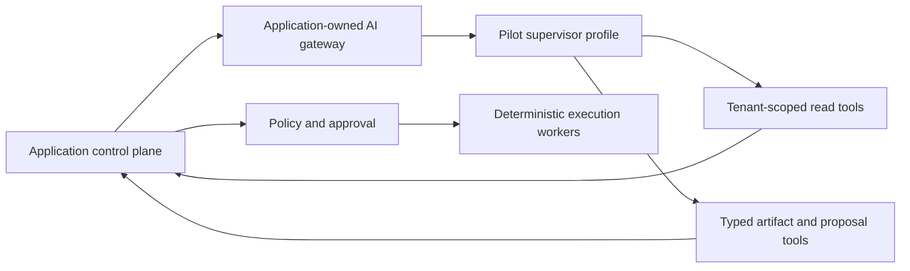

# Agent Gateway and Orchestration Boundary

## Objective

Use one supervisor profile through an application-owned AI gateway for the pilot.

Keep Hermes, model providers, and future frameworks outside the product's security, data, workflow, and execution authority.

## Canonical boundary

The supervisor owns bounded reasoning, task planning, run-local state, and tool selection within its envelope.

The gateway owns run envelopes, tool mediation, redaction, quotas, tracing, cancellation, and the stable provider/runtime contract.

Neither the model provider, gateway, nor future Hermes runtime owns canonical business state.

## Role model

The pilot uses one supervisor profile for onboarding, AI Reach assessment, outcome briefings, drafts, and proposals.

Add a specialist only when a separate evaluation shows better quality, safety, cost, or context isolation.

The expansion target can include bounded profiles for:

- business context and knowledge;
- research and competitive intelligence;
- cross-channel strategy and budget allocation;
- creative direction, copy, asset production, and quality review;
- each supported paid advertising platform;
- each supported organic publishing channel;
- measurement, attribution, experiments, and data quality;
- final plan assembly and conflict resolution by the chief orchestrator.

Roles have separate instructions, skills, evidence requirements, memory scopes, evaluation suites, model policies, and tool allowlists. They do not imply a permanently running process per role.

## Run contract

Every run receives an application-issued envelope containing:

- `organization_id`, user/service principal, role, task type, and correlation ID;
- allowed context references and maximum freshness;
- allowed read and proposal tool contracts;
- model/provider policy, token/tool budget, deadline, and cancellation token;
- policy and skill versions;
- untrusted-content labels and redaction rules.

Every run returns a typed artifact or proposal plus evidence references, assumptions, confidence, disagreements, cost/usage metadata, and terminal status. A run that lacks evidence or permission abstains or requests clarification.

## Tool boundary

Allowed agent tools are narrow, schema-validated application APIs such as scoped metric reads, knowledge retrieval, capability lookup, draft validation, artifact storage, and proposal submission.

Agents never receive:

- raw database connectivity;
- unrestricted filesystem, shell, or browser access in production;
- long-lived platform, model, database, or cloud credentials;
- a general mutation endpoint;
- cross-tenant search or memory;
- authority to approve their own proposals.

External content is untrusted data. Tool output is filtered, bounded, provenance-tagged, and tenant-scoped before it enters model context.

## Orchestration behavior

1. The application creates a durable task with explicit organization and permission context.
2. The gateway selects an allowed provider, model, and supervisor version.
3. The supervisor uses only the scoped evidence and tools in the envelope.
4. Deterministic work stays in ordinary code.
5. The supervisor returns an assessment, draft, recommendation, or proposal without hiding uncertainty.
6. The application validates the schema, evidence, cost, policy, freshness, and destination.
7. State-changing work proceeds only through the proposal, approval, deterministic execution, and reconciliation path.

Durable workflow state lives in application services, not in an agent conversation. A later Temporal adapter can use the same contract.

## Memory and tenancy

- Canonical context is versioned in the application data model.
- Retrieved context is scoped by organization, role, task, permission, and freshness.
- Short-term run state expires according to policy.
- Corrections supersede prior context without erasing audit history.
- Shared skills and prompt templates are immutable versions; client-specific configuration and memory remain isolated.
- Dedicated deployments use their dedicated data, storage, secrets, keys, and workers.

## Runtime containment and portability

The pilot can call the first model provider through the application-owned gateway without a separate Hermes deployment.

Hermes remains an expansion runtime for task submission, streamed events, tool calls, cancellation, usage, and results.

Runtime session IDs and provider payloads remain adapter metadata. Instructions, evaluations, tools, artifacts, and canonical context stay application-owned.

No runtime can replace tenant identity, authorization, PostgreSQL, secrets, approvals, billing, execution, audit, or observability.

Any later runtime selection needs explicit security, reliability, data, export, commercial, and migration review.

## Model routing

The gateway selects models by versioned task policy, not by role name alone. Policies consider task risk, modality, quality requirements, latency, cost, data restrictions, provider availability, and eval results. Provider outages degrade agent work visibly while deterministic monitoring, approvals, execution safety, and reconciliation continue.

## Evaluation and release

Each profile has held-out and adversarial evaluation suites covering schema validity, evidence accuracy, business-definition use, policy awareness, abstention, tool choice, cost, and unauthorized side-effect attempts. Cross-tenant leakage, secret disclosure, fabricated evidence/approval, destination substitution, or direct mutation attempts are release blockers.

Prompt, skill, model, tool, or provider changes are versioned, evaluated in staging, canaried, observable, and reversible. Production corrections may become privacy-reviewed evaluation cases.

## Operational controls

- Per-organization and per-task token, tool, time, and concurrency budgets.
- Run, tool, provider, cost, error, and cancellation telemetry.
- Global, tenant, role, provider, skill, and tool kill switches.
- No acknowledged external mutation without durable policy, approval, execution, reconciliation, and audit records.
- Model unavailability never relaxes authorization or approval requirements.
