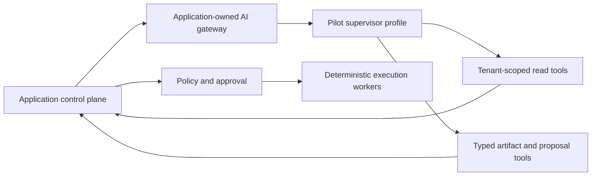

# Agent Gateway and Orchestration Boundary

## Objective

Use one Marketing Director profile through an application-owned AI gateway, with bounded specialists delegated through typed task contracts (D-043, accepted).

Keep the runtime, model providers, and future frameworks outside the product's security, data, workflow, and execution authority.

## Implemented behavior today

The current code has one model call per AI Reach question (`lib/ai-reach/model-answer.ts`). The model returns structured choices only; the application writes every sentence from saved data. There is no task contract, no delegation, no scheduled run, and no durable task record. Everything below in this document that describes the Director, specialists, task contracts, and runtime selection is agreed design.

## Canonical boundary

```mermaid
flowchart LR
    APP["Application control plane"] --> GW["Application-owned AI gateway"]
    GW --> SUP["Pilot supervisor profile"]
    SUP --> RT["Tenant-scoped read tools"]
    SUP --> PT["Typed artifact and proposal tools"]
    RT --> APP
    PT --> APP
    APP --> POL["Policy and approval"]
    POL --> EXE["Deterministic execution workers"]
```

The supervisor owns bounded reasoning, task planning, run-local state, and tool selection within its envelope.

The gateway owns run envelopes, tool mediation, redaction, quotas, tracing, cancellation, and the stable provider/runtime contract.

Neither the model provider, gateway, nor future Hermes runtime owns canonical business state.

## Role model

The Marketing Director is the supervisor profile. It owns priorities, channel coordination, budget proposals, owner communication, onboarding diagnosis, briefings, and plan state. It cannot approve or execute external changes.

The first complete workflow adds:

| Role | Responsibility | Required output |
|---|---|---|
| Marketing Director | Priorities, coordination, budget proposals, owner communication | A coherent plan and an ordered work queue; ranked decisions or an explicit quiet state |
| Paid-search specialist (Google Ads) | Channel research, campaign package design, creative requirements, performance assessment | Native campaign package drafts and action proposals with predictions |
| Content and creative support (draft mode) | Landing-page and content drafts, copy variants, creative briefs for the same offer | Source-backed drafts with claim provenance; no publication |
| Measurement service (deterministic) | Definitions, data quality, reconciliation, experiments | Decision-ready evidence with limits |
| Quality review (advisory) | Independent review of important outputs | Pass, revise, or reject with reasons |

These are logical roles. They need not be separate processes or providers. Start with the smallest arrangement that passes quality and cost evaluations. Add a further specialist only when a separate evaluation shows better quality, safety, cost, or context isolation.

The Director preserves disagreement between specialists and states the tradeoff in the proposal. It recognizes when the best next task concerns the offer, tracking, lead handling, or capacity, and surfaces that instead of creating advertising work.

The expansion target can include bounded profiles for:

- business context and knowledge;
- research and competitive intelligence;
- cross-channel strategy and budget allocation;
- creative direction, copy, asset production, and quality review;
- each supported paid advertising platform;
- each supported organic publishing channel;
- measurement, attribution, experiments, and data quality;
- final plan assembly and conflict resolution by the chief orchestrator.

Roles have separate instructions, skills, evidence requirements, memory scopes, evaluation suites, model policies, and tool allowlists. They do not imply a permanently running process per role.

## Run contract

Every run receives an application-issued envelope containing:

- `organization_id`, user/service principal, role, task type, and correlation ID;
- allowed context references and maximum freshness;
- allowed read and proposal tool contracts;
- model/provider policy, token/tool budget, deadline, and cancellation token;
- policy and skill versions;
- untrusted-content labels and redaction rules.

Every run returns a typed artifact or proposal plus evidence references, assumptions, confidence, disagreements, cost/usage metadata, and terminal status. A run that lacks evidence or permission abstains or requests clarification.

## Task contract (D-043)

Every delegated task contains:

| Field | Purpose |
|---|---|
| Organization and task identity | Enforce scope and prevent duplicate work |
| Goal and acceptance criteria | Define useful completion |
| Assigned role and version | Make behavior traceable |
| Allowed tools and resources | Bound access |
| Business memory and policy versions | Bind the task to approved context |
| Evidence references and freshness | Support decisions |
| Cost, time, and iteration limits | Prevent uncontrolled loops |
| Dependencies and current state | Support durable work |
| Expected output schema | Validate the result |
| Escalation and cancellation rules | Handle uncertainty and interruption |

Proposals carry a prediction before approval (LRN-001). Store concise decision explanations. Do not require private chain-of-thought as an audit artifact.

## Tool boundary

Allowed agent tools are narrow, schema-validated application APIs such as scoped metric reads, knowledge retrieval, capability lookup, draft validation, artifact storage, and proposal submission.

Agents never receive:

- raw database connectivity;
- unrestricted filesystem, shell, or browser access in production;
- long-lived platform, model, database, or cloud credentials;
- a general mutation endpoint;
- cross-tenant search or memory;
- authority to approve their own proposals.

External content is untrusted data. Tool output is filtered, bounded, provenance-tagged, and tenant-scoped before it enters model context.

## Orchestration behavior

1. The application creates a durable task with explicit organization and permission context.
2. The gateway selects an allowed provider, model, and supervisor version.
3. The supervisor uses only the scoped evidence and tools in the envelope.
4. Deterministic work stays in ordinary code.
5. The supervisor returns an assessment, draft, recommendation, or proposal without hiding uncertainty.
6. The application validates the schema, evidence, cost, policy, freshness, and destination.
7. State-changing work proceeds only through the proposal, approval, deterministic execution, and reconciliation path.

Durable workflow state lives in application services, not in an agent conversation. A later Temporal adapter can use the same contract.

## Memory and tenancy

- Canonical context is versioned in the application data model.
- Retrieved context is scoped by organization, role, task, permission, and freshness.
- Short-term run state expires according to policy.
- Corrections supersede prior context without erasing audit history.
- Shared skills and prompt templates are immutable versions; client-specific configuration and memory remain isolated.
- Dedicated deployments use their dedicated data, storage, secrets, keys, and workers.

## Runtime containment and portability

The pilot calls the organization-selected model provider through the application-owned gateway without a separate Hermes deployment (D-039, D-041).

### Runtime selection (D-046, accepted)

- Build a small application-owned tool loop as the reference implementation.
- Run a prototype of at most two weeks against mocked tools and a stable gateway contract (joint plan task B-05). Decide earlier when evidence suffices.
- The Claude Agent SDK is the leading candidate. Select it only if it shows a measured advantage and passes these checks: runs in the product's hosting, tool allowlists hold under an adversarial tool-call test, a killed process resumes from durable application state, cost is acceptable, and the per-organization provider adapter still works for the tested combinations.
- Record exactly which runtime and provider combinations were tested and work. The Agent SDK's Claude runtime is not automatically compatible with every provider in D-041.
- If the prototype fails, the application-owned loop is the runtime. No third option is searched for.

Hermes remains a reference design and expansion runtime for task submission, streamed events, tool calls, cancellation, usage, and results.

Runtime session IDs and provider payloads remain adapter metadata. Instructions, evaluations, tools, artifacts, task records, proposals, executions, learning records, and canonical context stay application-owned so the runtime can change later.

No runtime can replace tenant identity, authorization, PostgreSQL, secrets, approvals, billing, execution, audit, or observability.

Any later runtime change needs explicit security, reliability, data, export, commercial, and migration review.

## Model routing

The gateway selects models by versioned task policy, not by role name alone. Policies consider task risk, modality, quality requirements, latency, cost, data restrictions, provider availability, and eval results. Provider outages degrade agent work visibly while deterministic monitoring, approvals, execution safety, and reconciliation continue.

## Evaluation and release

Each profile has held-out and adversarial evaluation suites covering schema validity, evidence accuracy, business-definition use, policy awareness, abstention, tool choice, cost, and unauthorized side-effect attempts. Cross-tenant leakage, secret disclosure, fabricated evidence/approval, destination substitution, or direct mutation attempts are release blockers.

Prompt, skill, model, tool, or provider changes are versioned, evaluated in staging, canaried, observable, and reversible. Production corrections may become privacy-reviewed evaluation cases.

Skill and prompt promotion needs offline evaluation on a held-out set plus operator approval. Model-routing changes need operator approval and a regression evaluation. A critical safety failure blocks promotion regardless of average scores (D-047). The Director may propose a change to a playbook or skill as a diff with evidence; a human merges it after the evaluation passes. No agent edits its own prompts, skills, or permissions in production.

## Operating loops (agreed design)

- **Daily:** data-health and spend-pacing check; Director briefing with ranked decisions or an explicit quiet state. A daily schedule must not force daily campaign changes.
- **Event-driven:** sync completed, anomaly detected, approval changed, platform rejected or changed an object, experiment reached a decision boundary.
- **Weekly:** review of mature experiments, rejected work, recurring errors, and the research task that introduces new ideas from approved first-party material and current platform evidence.
- **Monthly:** review of skill candidates, model routing, and playbook drift.
- **On a material change:** recheck affected capabilities and skill assumptions after a provider change, incident, new offer, or tracking change.

Schedules trigger application workflows, which decide whether an agent run is needed.

## Operational controls

- Per-organization and per-task token, tool, time, and concurrency budgets.
- Run, tool, provider, cost, error, and cancellation telemetry.
- Global, tenant, role, provider, skill, and tool kill switches.
- No acknowledged external mutation without durable policy, approval, execution, reconciliation, and audit records.
- Model unavailability never relaxes authorization or approval requirements.
