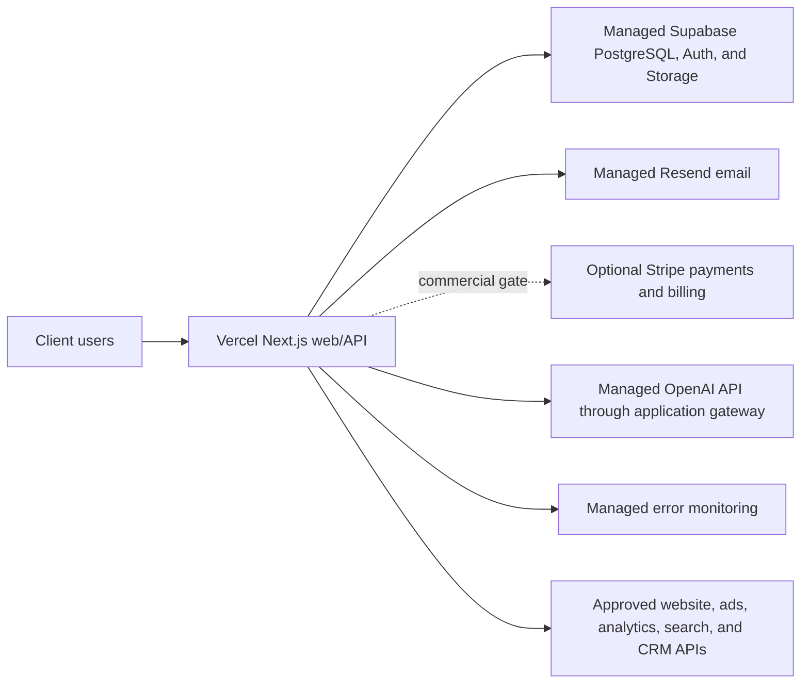
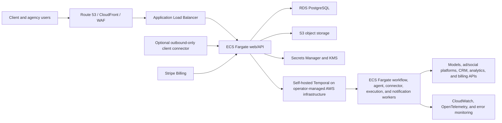

# Cloud Hosting and Service Delivery

## Status

Accepted architecture and commercial-delivery decision. This document defines how the marketing agent system is hosted, isolated, operated, and sold. Exact vendors may change behind application-owned contracts, but the deployment and trust boundaries below control implementation.

## Decision summary

- The product is a cloud-hosted managed service that clients can use through an authenticated web application from anywhere.
- The initial pooled pilot uses managed customer-facing and data services. It does not require a separate self-hosted automation plane.
- AWS is the scale, compliance, and dedicated-deployment target rather than a Phase 0 prerequisite.
- Most clients use a pooled multi-tenant deployment. Higher-isolation clients can purchase a dedicated deployment. A hybrid client-site connector is available only when private/local systems require it.
- A client-owned always-on device is not the default hosting model and never becomes the authoritative control plane.
- The pilot uses one supervisor through an application-owned AI gateway. Hermes remains a trigger-based expansion runtime.
- OpenAI model APIs and Resend transactional email remain managed services. They are not candidates for local-model or self-hosted email replacement.
- Vercel, managed Supabase, GitHub, and Sentry use suitable managed tiers. Stripe starts only after the commercial gate.
- Coolify, Hermes, Temporal, Postiz, separate workers, and the OpenTelemetry collector require a recorded trigger and readiness gate.
- Deterministic application services retain identity, tenancy, policy, approvals, billing, credentials, execution, audit, and rollback authority.
- The pilot can use manual commercial terms. Automated payment and invoice processing are later commercial features.

## Why cloud-first

Cloud hosting gives clients an always-available portal while allowing the operator to centralize deployments, monitoring, backups, incident response, kill switches, and security updates. A client device adds avoidable failure modes around power, internet access, patching, credentials, webhook reachability, backup, and remote support.

A local device also does not by itself make the system private when it calls hosted models, advertising platforms, CRMs, or other APIs. Fully local processing would require local models, local storage, local backup, and a materially different support model. That option is justified only by a real contractual, data-residency, or local-network requirement.

## Cost and performance policy

- Prefer a managed free tier when it satisfies the current environment's commercial-use terms, backup and recovery needs, SLO, retention, collaboration, security, and capacity requirements.
- Prefer self-hosting when the software has a maintained open-source distribution, an official reproducible deployment, measurable performance parity for the expected load, safe backup/restore and upgrade paths, and lower total operating cost.
- Do not count software license cost as total cost. Compute, storage, backups, monitoring, patching, incident response, and operator time remain real costs.
- Do not run duplicate paid infrastructure without a recorded resilience, migration, compliance, or performance reason.
- Upgrade or move a service only when a measured threshold is reached; do not pre-purchase capacity for an unimplemented feature.
- OpenAI, Resend, Stripe/card networks, and official advertising/social APIs remain managed external dependencies because self-hosting cannot preserve equivalent model quality, email deliverability, payment processing, or platform authority.

## Deployment profiles

| Profile | Default customer | Isolation | Ownership | Commercial treatment |
|---|---|---|---|---|
| Pooled managed cloud | Most SMB and midmarket clients | Shared managed services with tenant-scoped application controls | Operator-owned Vercel/Supabase; later services and AWS only when triggered | Standard platform and management plans |
| Dedicated managed cloud | Regulated, privacy-sensitive, enterprise, or high-volume clients | Separate AWS account, database, storage, keys, secrets, workers, and network controls | Operator-owned account or client-owned account with a restricted management role | Dedicated-cloud setup and recurring premium |
| Hybrid bridge | Client with required local/private data or systems | Cloud control plane plus a narrowly scoped client-site connector | Cloud remains authoritative; client owns the edge host | Connector setup, monitoring, and support premium |

The pooled, dedicated, and hybrid profiles follow the pool/silo/bridge model. They share one product contract and codebase; isolation changes must not fork business logic.

### Pooled managed cloud

- Every tenant-owned record carries `organization_id`.
- Service and repository calls require explicit organization context.
- PostgreSQL row-level security supplies defense in depth where practical.
- Object keys, workflow payloads, caches, agent context, secrets, audit records, budgets, and cost attribution are tenant-scoped.
- Per-tenant quotas and fair-use controls prevent noisy-neighbor failures.

### Dedicated managed cloud

- Provision from the same infrastructure-as-code modules and immutable application artifacts as pooled production.
- Use a separate AWS account and separate RDS, S3, KMS keys, Secrets Manager secrets, worker services, and environment configuration.
- Support either operator ownership or a client-owned AWS account. In a client-owned account, the client grants a least-privilege management role; contracts define cost responsibility, emergency access, evidence delivery, and offboarding.
- Do not promise that dedicated infrastructure removes all subprocessors; model and platform integrations remain explicit in the data-flow inventory.

### Hybrid bridge

- Install only when an approved integration cannot safely or contractually send its required source data directly to the cloud.
- The connector initiates outbound mutually authenticated connections; no general inbound remote administration port is required.
- It receives narrowly scoped jobs, accesses allowlisted local systems, returns minimum necessary results, and buffers safely during outages.
- It holds only scoped, revocable credentials and has signed updates, health reporting, tamper-aware audit, automatic expiry, and remote disablement.
- It cannot approve actions, hold canonical business state, bypass cloud policy, or become the only copy of audit or workflow state.

## Initial pooled pilot deployment

### Initial service mapping

| Capability | Initial service |
|---|---|
| Client-facing Next.js web/API | Vercel Pro for commercial use, with usage budgets and rollback |
| Transactional/canonical data, identity, and files | Managed Supabase Free during controlled testing; Pro before production data requires automatic backups and non-pausing availability |
| Models | Managed OpenAI API behind the application-owned AI gateway |
| Transactional and authentication email | Managed Resend; Free while volume remains within the published daily/monthly limits |
| Payments and billing | Manual pilot terms; optional Stripe after the commercial gate |
| Code hosting and CI | GitHub Free while included collaboration, storage, and CI limits remain sufficient |
| Durable jobs | Application-owned job state, outbox, and bounded scheduler; Temporal only after a recorded trigger |
| Agent runtime | One supervisor through the application-owned gateway; Hermes only after a recorded trigger |
| Organic publishing fallback | Not a pilot service; Postiz remains an expansion option |
| Telemetry | Application telemetry plus managed Sentry while its limits remain safe |
| Secrets | Vercel/Supabase managed secrets and the application `SecretBroker` boundary |
| Infrastructure and release | Versioned container definitions, deployment configuration, backups, and immutable artifacts portable to AWS |

The initial services need explicit health checks, timeouts, durable state, and degraded modes.

A later automation host cannot bypass application authorization, policy, approvals, audit, or tenant isolation.

## AWS scale and dedicated reference deployment

### AWS service mapping after a recorded migration trigger

| Capability | AWS or managed service |
|---|---|
| DNS, edge delivery, and application firewall | Route 53, CloudFront, AWS WAF |
| Web/API and modular workers | ECS on Fargate behind an Application Load Balancer |
| Transactional and canonical data | RDS for PostgreSQL with encryption, automated backups, and point-in-time recovery |
| Files, raw payloads, evidence, and exports | S3 with encryption, tenant prefixes, versioning/lifecycle rules as required |
| Durable workflows | Self-hosted Temporal on AWS behind the application-owned workflow abstraction; Temporal Cloud only if an explicit reliability/operations review approves it |
| Secrets and encryption keys | AWS Secrets Manager and KMS with rotation and least-privilege access |
| Telemetry | OpenTelemetry plus CloudWatch; Sentry or self-hosted SigNoz remains replaceable |
| Billing | Stripe Billing plus an application-owned entitlement and usage ledger |
| Identity | Supabase Auth initially; standards-based managed identity with MFA and future SSO support remains replaceable |
| Infrastructure and release | Versioned infrastructure as code and immutable container artifacts |

AWS migration triggers include measured capacity or latency limits, an SLO that the initial hybrid cannot meet, dedicated-client isolation, data residency, enterprise networking, or compliance requirements. ECS services scale on queue depth, CPU, memory, latency, and workflow demand. Mutation workers have stricter identities and network policies than read and proposal workers. Production databases and secret stores are never directly reachable from client browsers or agent tools.

## Agent runtime decision

The application exposes a stable AI gateway contract and uses one supervisor profile for the pilot.

The gateway routes approved tenant-scoped tasks to the selected model provider. It exposes read and typed artifact or proposal tools only.

Hermes can implement the same contract after a recorded trigger. Runtime sessions and provider payloads remain adapter metadata.

Hyperagent may be evaluated in a non-production prototype or internal operator workflow, but it is not selected as the hosted product runtime. Replacing Hermes with Hyperagent would require a new recorded decision plus tenant-isolation, data handling, audit, tool-boundary, reliability, exportability, commercial/resale, migration, and incident-response review. It may not absorb the deterministic control plane.

## Ownership and responsibility

### Operator responsibilities

- Provisioning, releases, patches, backups, restore tests, monitoring, incident response, capacity, secrets hygiene, and vendor integrations.
- Tenant isolation, entitlement enforcement, usage measurement, audit retention, data export, and offboarding.
- Clear service status, support channels, maintenance policy, and SLA/SLO reporting for the purchased tier.

### Client responsibilities

- Authorized users, business and marketing data accuracy, account ownership, platform permissions, content/claim approvals, and lawful use.
- Approval and autonomy policy owners.
- For client-owned AWS or hybrid profiles, timely access to the account/site, network prerequisites, and a named technical contact.

### Shared-responsibility artifacts

Contracts and onboarding must identify data ownership, subprocessors, retention, deletion/export, credential revocation, account ownership, usage limits, overages, support hours, incident notification, residency, and offboarding responsibilities.

## Commercial packaging and metering

Each client agreement may contain these independently visible components:

1. One-time discovery, onboarding, connection, migration, training, and setup fee.
2. Recurring platform/hosting subscription tied to plan entitlements.
3. Recurring managed operations, strategy, support, or SLA fee where purchased.
4. Metered AI, media-generation, workflow, storage, messaging, and third-party tool usage with an included allowance and explicit overage or pass-through policy.
5. Dedicated-cloud, client-owned-account, data-residency, or hybrid-connector setup and recurring premiums.

The pilot keeps tenant-scoped usage and provider-cost records with cost limits. Automated billing adds price versions, allowances, corrections, and invoice reconciliation later.

## Service upgrade and migration gates

- **Vercel:** use a commercial plan for the client-facing business application; reconsider self-hosted web delivery only if measured cost, portability, or enterprise requirements outweigh Vercel's deployment and edge-performance benefits.
- **Supabase:** Free is acceptable for controlled testing. Upgrade before important production data depends on automatic backups, non-pausing availability, greater storage, or support. Self-host only after a restore-tested operations review shows no material reliability or efficiency loss.
- **Resend:** stay managed and upgrade only when volume, domains, retention, or support exceed the current tier.
- **Sentry:** use the one-user free tier initially. Adopt self-hosted SigNoz when team access, telemetry volume, retention, or cost justifies operating the backend.
- **Temporal:** add only when measured workflow duration, retries, schedules, or reliability exceed the pilot job design.
- **Hermes:** add only when evaluation or scale evidence justifies specialist orchestration beyond the pilot supervisor.
- **Postiz:** keep outside the pilot. Evaluate it only when approved organic publishing enters scope.
- **Coolify and SigNoz:** add only when the services they host have approved operational owners and restore-tested deployment gates.
- **AWS:** provision the pooled or dedicated AWS foundation when traffic, isolation, compliance, residency, enterprise networking, or SLO evidence triggers it. Retire replaced Vercel/Supabase/automation-host capacity after migration unless an approved resilience design requires overlap.

## Provisioning and lifecycle

1. Use the pooled profile for the pilot. Select a later profile only after its trigger is approved.
2. Record region, residency, identity, data-flow, connector, support, and ownership requirements.
3. Provision repeatably from infrastructure as code and issue tenant/account-scoped identities and secrets.
4. Run tenant isolation, restore, connector, agent, approval, audit, cost-limit, and kill-switch acceptance tests.
5. Monitor deployment, tenant, workflow, connector, usage, and cost health without exposing one tenant to another.
6. On offboarding, disable execution, revoke integrations and roles, export agreed data/evidence, execute retention/deletion policy, and preserve required billing/audit records.

## Consequences

- The operator can charge recurring hosting and management fees because it delivers an operated service, not a one-time device installation.
- Pooled hosting keeps the normal plan economical; dedicated and hybrid complexity is separately priced.
- The initial pooled pilot avoids unused automation and payment services while retaining managed customer-facing, model, email, and platform integrations.
- AWS and selected managed services are implementation choices and migration targets, while application contracts, data formats, container definitions, and infrastructure modules preserve portability.
- Self-hosting adds explicit patching, backup/restore, capacity, monitoring, security, and incident-response duties; failing those duties is a release blocker.
- A client appliance is an integration exception, not a competing product architecture.

## Primary references

- [AWS SaaS Lens: silo, pool, and bridge models](https://docs.aws.amazon.com/wellarchitected/latest/saas-lens/silo-pool-and-bridge-models.html)
- [Amazon ECS service auto scaling](https://docs.aws.amazon.com/AmazonECS/latest/developerguide/service-auto-scaling.html)
- [Amazon RDS encryption](https://docs.aws.amazon.com/AmazonRDS/latest/UserGuide/Overview.Encryption.html)
- [Amazon RDS backup and recovery](https://docs.aws.amazon.com/prescriptive-guidance/latest/backup-recovery/rds.html)
- [AWS Secrets Manager rotation](https://docs.aws.amazon.com/secretsmanager/latest/userguide/rotating-secrets.html)
- [AWS Systems Manager hybrid and multicloud nodes](https://docs.aws.amazon.com/systems-manager/latest/userguide/systems-manager-hybrid-multicloud.html)
- [Coolify self-hosting](https://coolify.io/docs/get-started/introduction)
- [Temporal self-hosting](https://docs.temporal.io/self-hosted-guide)
- [Postiz self-hosting](https://docs.postiz.com/installation/system-requirements)
- [Supabase pricing and limits](https://supabase.com/pricing)
- [Vercel pricing and commercial plans](https://vercel.com/pricing)
- [Sentry pricing](https://sentry.io/pricing/)
- [SigNoz self-hosting](https://signoz.io/docs/install/self-host/)
- [Resend pricing](https://resend.com/pricing)
- [Stripe usage-based billing](https://docs.stripe.com/billing/subscriptions/usage-based)
