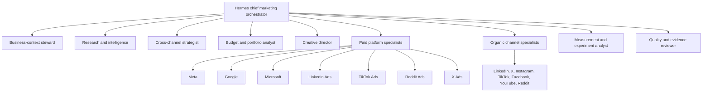

# Hermes Multi-Agent Architecture

> Status: expansion target. The pilot uses one supervisor through the application-owned AI gateway. Hermes is not a pilot release gate.

## Role of Hermes

Hermes is the target runtime for later specialist coordination. It remains behind the application-owned gateway and never becomes an authority.

## Logical agent organization



These are expansion roles. Each added role needs a distinct profile, task contract, tool allowlist, memory scope, and evaluation suite.

The pilot supervisor covers AI Reach, outcome briefings, drafts, and proposals until evidence justifies a split.

## Role contracts

### Chief marketing orchestrator

- Decomposes user goals into tasks.
- Selects roles and dependencies.
- Maintains plan state and assembles final artifacts.
- Escalates ambiguity and disagreement.
- Cannot approve or execute external changes.

### Business-context steward

- Resolves offers, audiences, brand rules, claims, economics, and prior corrections.
- Detects conflicts or stale context.
- Proposes context updates for human confirmation.

### Research and intelligence agent

- Collects permitted market, competitor, customer, trend, and channel evidence.
- Preserves sources, dates, and confidence.
- Treats retrieved content as untrusted.

### Cross-channel strategist

- Defines the role of each selected paid and organic platform.
- Connects funnel stage, offer, audience, objective, creative, and measurement.
- Produces alternatives and assumptions rather than false certainty.

### Budget and portfolio analyst

- Reads deterministic forecasts and canonical outcomes.
- Proposes allocations and reallocation experiments.
- Does not calculate authoritative spend or perform transfers itself.

### Creative director

- Produces concepts, claims, briefs, variant plans, and review rubrics.
- Coordinates asset generation and channel adaptation.
- Preserves provenance, usage rights, and brand constraints.

### Paid platform specialists

- Translate the cross-channel plan into platform-native draft specifications.
- Understand platform capability, structure, policy feedback, and reporting semantics.
- Use read and draft-validation tools only; execution remains external.

### Organic channel specialists

- Produce native content variants and metadata.
- Respect account voice, community rules, format, and content provenance.
- Do not publish directly.

### Measurement and experiment analyst

- Interprets canonical metrics and experiment results.
- Identifies uncertainty, confounding, and missing data.
- Recommends continue/stop/adopt decisions but cannot rewrite metric definitions.

### Quality and evidence reviewer

- Checks completeness, factual support, brand fit, platform constraints, and contradictions.
- May return artifacts for revision or request human review.
- Is advisory; deterministic policy remains authoritative.

## Task envelope

Every delegated task uses a versioned envelope:

```json
{
  "task_id": "tsk_...",
  "organization_id": "org_...",
  "role": "linkedin_organic_specialist",
  "objective": "Create a native LinkedIn variant",
  "inputs": [{"type": "source_brief", "id": "brief_...", "version": 4}],
  "constraints": [{"type": "brand_policy", "id": "policy_...", "version": 7}],
  "allowed_tools": ["get_source_brief", "get_brand_profile", "submit_content_variant"],
  "required_output_schema": "content_variant.v1",
  "deadline": "2026-08-07T16:00:00Z",
  "correlation_id": "wf_..."
}
```

The gateway derives organization and tool scope server-side; the model cannot select a different tenant by changing an argument.

## Output contract

Agent outputs contain:

- artifact type and schema version;
- claims and evidence references;
- assumptions and unresolved questions;
- confidence calibrated to a documented scale;
- alternatives considered;
- policy-sensitive elements requiring review;
- proposed next step;
- no hidden side-effect instructions.

Private chain-of-thought is not requested or stored. The audit record contains concise rationale, evidence, inputs, outputs, and decisions.

## Memory architecture

### Durable application context

Authoritative records for brand, offers, audiences, metrics, policies, decisions, and experiment outcomes remain in the application database.

### Agent working memory

Task-local scratch state expires with the run and is never treated as authoritative.

### Agent episodic memory

Curated summaries of prior tasks and corrections may be retained with source, tenant, role, timestamp, confidence, retention, and review state.

### Skill memory

Reusable procedures are versioned skills with owner, supported roles, input/output schemas, tool requirements, test cases, and last review date.

Hermes memory must not become an unreviewed shadow database.

## Tool classes

- **Read tools:** scoped retrieval of context, metrics, platform state, evidence, and capabilities.
- **Analysis tools:** deterministic calculations, forecasts, validation, and comparison.
- **Artifact tools:** submit a draft, brief, recommendation, or proposal.
- **No direct mutation tools:** production platform writes are never callable by an agent role.

If an agent-facing tool needs to request an action, it creates a proposal through the application. The policy and approval workflow remains outside Hermes.

## Operating loops

### Event-driven

- Connector sync completed.
- Material anomaly detected.
- User requested a campaign or content item.
- Approval changed.
- Platform rejected or changed an object.
- Experiment reached a decision boundary.

### Scheduled

- Daily data-health and performance brief.
- Daily content and campaign opportunity review.
- Weekly executive report and experiment review.
- Periodic context, skill, policy, and connector capability review.

### Interactive

- Conversational questions.
- Guided campaign and content creation.
- Explanation or revision requests.

Schedules trigger application workflows, which decide whether an agent run is needed.

## Model routing

The Hermes gateway selects models by task policy:

- inexpensive models for classification and transformations with strong evals;
- high-reasoning models for strategy, diagnosis, and adjudication;
- multimodal models for creative review;
- deterministic code for metrics and validation.

Provider/model changes require eval comparison. No role assumes one provider's undocumented behavior.

## Security controls

- Separate Hermes workspace/profile per organization and environment.
- Tool allowlists per role and task.
- Short-lived signed tool tokens with organization, role, purpose, and expiry.
- No raw platform refresh tokens, database credentials, or managed-secret values in prompts.
- Egress allowlists for gateway and connector processes.
- Size, type, and malware controls on retrieved files.
- Prompt-injection markers and policy separation for external content.
- Run time, token, cost, recursion, and tool-call limits.
- Human escalation on repeated failures or ambiguous high-risk content.

## Agent evaluation gates

Each role requires:

- golden task set;
- schema validity rate;
- factual/evidence correctness;
- policy-sensitive detection recall;
- abstention quality;
- brand and platform rubric scores;
- regression comparison by skill/model version;
- adversarial prompt-injection tests;
- cost and latency budgets.

A skill or model version cannot reach production when a critical policy, tenant, or side-effect test fails.

## Expansion deployment recommendation

Deploy Hermes only after a recorded workflow, quality, scale, or isolation trigger.

Start with logical specialist profiles and isolated tool tokens. Split services only when scale, security, cost, or evaluation evidence requires it.
