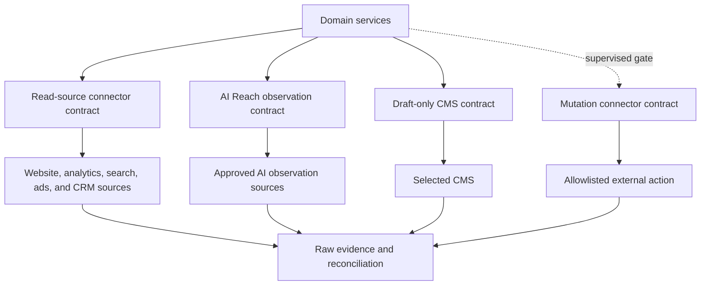

# Platform Integration Architecture

## Objective

Prove one complete read-only business loop through the approved pilot connectors.

Keep each later connector behind the same capability, eligibility, evidence, security, and release contracts.

## Adapter layers

## Connector interface

### ReadConnector

Every pilot read connector provides:

- provider identity and connector version;
- authorization requirements and granted-scope inspection;
- account discovery;
- capability discovery;
- incremental read synchronization;
- external-state reconciliation;
- rate-limit and retry metadata;
- webhook verification and ingestion where available;
- normalized errors and raw diagnostic references;
- revocation and deletion behavior.

### AIReachObservationAdapter

Provides surface identity, provider and interface version, sample capability, locale support, repeated observation, citation extraction, cost, quota, and normalized limitations.

### DraftConnector

Provides draft validation, idempotent draft creation, external identifier capture, reconciliation, and draft expiry or deletion behavior.

### MutationConnector

Provides typed preflight, mutation preparation, idempotent execution, external-state reconciliation, rollback capability, and normalized uncertainty.

The first useful release enables only `ReadConnector` and observation capabilities.

## Capability keys

Examples:

- `paid.account.read`
- `paid.campaign.read`
- `paid.insights.read`
- `paid.campaign.create`
- `paid.campaign.pause`
- `paid.campaign.resume`
- `paid.budget.update`
- `paid.audience.customer_list`
- `paid.creative.image_upload`
- `paid.creative.video_upload`
- `website.crawl.read`
- `website.content.read`
- `website.index_eligibility.read`
- `search.performance.read`
- `search.index.inspect`
- `ai_reach.answer.observe`
- `ai_reach.citation.observe`
- `ai_reach.referral.read`
- `cms.page.read`
- `cms.draft.create`
- `cms.page.publish`
- `crm.lead.read`
- `crm.outcome.read`
- `calendar.booking.read`
- `email.delivery.read`
- `email.draft.create`
- `email.message.send`
- `organic.text.publish`
- `organic.image.publish`
- `organic.video.publish`
- `organic.carousel.publish`
- `organic.schedule.native`
- `organic.analytics.read`
- `organic.comments.read`
- `organic.comments.reply`

Capabilities are evaluated per connection/account and cached with expiry. The product never uses provider name alone as proof of a capability.

The first release enables read and observation keys only. CMS draft, email send, paid pause/resume, and CMS publish each need separate gates.

## Pilot paid read contract

Google Ads and Meta Ads must support:

1. Authorized account connection and account discovery.
2. Capability and eligibility display.
3. Campaign hierarchy and status ingestion.
4. Spend, performance, creative metadata, and available conversion ingestion.
5. Landing-page linkage and data-quality status.
6. Freshness and source reconciliation.
7. Normalized user-facing errors and repair steps.

The supervised stage adds `paid.campaign.pause` and `paid.campaign.resume` for one approved provider, account, and campaign class.

Campaign creation, budget changes, audience changes, creative upload, and Microsoft, LinkedIn, TikTok, Reddit, and X are expansion work.

If the provider or account blocks an action, the product shows the limit. Browser automation never simulates API availability.

## Website and CMS pilot contract

The pilot must support:

1. Approved website ownership and canonical origin.
2. Bounded crawl and page snapshots.
3. Robots, index, canonical, sitemap, content, and structured-data observations.
4. Search Console and GA4 resource mapping.
5. CMS page reads when the approved route permits them.
6. Idempotent CMS draft creation only after its supervised gate passes.
7. Exact draft destination and reconciliation.
8. Public publishing only through a later action gate.

## Organic connector expansion contract

When selected for expansion, each of LinkedIn, X, Instagram, TikTok, Facebook, YouTube, and Reddit must support:

1. Authorized identity/account selection.
2. Content-type capability discovery.
3. Draft validation for current text/media constraints.
4. Approved immediate or scheduled delivery through an authorized route.
5. Idempotency/duplicate protection.
6. Publication-state reconciliation and public identifier/URL where available.
7. Available analytics ingestion.
8. Explicit limitations for comments, replies, edits, deletion, or native scheduling.

## Native versus provider routes

The domain uses a `PublishingRoute` chosen per organization, platform, account, and capability:

- `native`: direct official platform API.
- `postiz`: authorized self-hosted Postiz integration.
- `other_authorized_provider`: future implementation satisfying the same contract.

Route selection considers granted permission, feature coverage, reliability, cost, analytics, app review, and user preference. A route change never changes the content/proposal identity and must preserve audit linkage.

Direct native integration is preferred for critical/high-volume channels and features. A provider route accelerates broad organic coverage but is not the source of truth for product authorization.

## Sync strategy

- Incremental windows with overlap to catch late corrections.
- Provider cursor/watermark stored per account and resource.
- Webhooks trigger targeted sync, not blind trust in webhook payloads.
- Raw responses stored with checksum, request window, connector version, and ingestion time.
- Normalization is replayable from raw data.
- Sampled reconciliation against platform UI/report exports before release.
- Currency and time-zone normalization preserves original values.
- Website page snapshots are immutable and content-addressed.
- AI Reach runs preserve question-set, surface, provider, method, model, locale, sample, cost, and limitation data.
- Partial AI Reach runs remain partial and do not become complete averages.

## Write strategy

The first useful release has no write principal.

The pilot MVP enables CMS draft creation, approved lead follow-up, and one advertising pause/resume pair through separate principals.

Public CMS publishing remains disabled until a later gate.

1. Generate domain desired state.
2. Resolve current capability snapshot.
3. Translate through connector schema.
4. Validate locally and, where available, through provider validation.
5. Freeze proposal and obtain policy/approval decision.
6. Re-read critical current state.
7. Execute with an idempotency key or application deduplication guard.
8. Persist request/response references.
9. Poll or consume webhook until terminal state.
10. Reconcile the external resource into canonical state.

## Partial multi-platform execution

Cross-platform launch is a saga, not a distributed transaction. Each platform action is independently approved and recorded. If one platform fails:

- completed independent launches remain intact;
- dependent launches stop;
- the user sees exact partial state;
- automatic retries follow connector policy;
- compensating pause/archive proposals are offered when appropriate;
- budget projections are recalculated before unlaunched work proceeds.

## Credential design

- OAuth refresh tokens/API keys remain in a managed secret store.
- Database stores opaque secret references and granted scopes.
- Connector workers obtain short-lived access at execution time.
- Separate read and mutation connections/principals where supported.
- Revocation immediately disables schedules, proposals, and executions for the connection.
- Sandbox/test accounts are never shared with production tenant context.
- Internal reasoning-model credentials remain separate from AI Reach observation credentials.
- Customer source credentials remain separate from CMS draft, public publishing, lead-send, and advertising-mutation principals.
- A customer's consumer AI account is not a product connection.

## Connector release checklist

- Current official API and policy review documented.
- Developer app and account eligibility verified.
- Read/write scopes minimized and displayed.
- Capability matrix implemented.
- Sandbox or approved test account exercised.
- Recorded payload normalization tests pass.
- Rate-limit, timeout, retry, and unknown-result paths pass.
- Idempotency and duplicate protection pass.
- Tenant isolation and secret redaction pass.
- External state reconciles after each supported write.
- User-facing limitations and remediation are documented.
- Kill switch tested.
