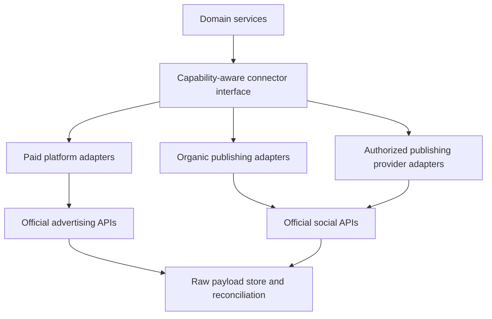

# Platform Integration Architecture

## Objective

Offer all committed paid and organic platforms in the MVP without pretending that their APIs, account eligibility, objects, or workflows are identical.

## Adapter layers

## Connector interface

Every connector provides:

- provider identity and connector version;
- authorization requirements and granted-scope inspection;
- account discovery;
- capability discovery;
- incremental read synchronization;
- draft validation;
- mutation preparation;
- idempotent execution where provider semantics permit;
- external-state reconciliation;
- rate-limit and retry metadata;
- webhook verification and ingestion where available;
- normalized errors and raw diagnostic references;
- revocation and deletion behavior.

## Capability keys

Examples:

- `paid.account.read`
- `paid.campaign.create`
- `paid.campaign.pause`
- `paid.budget.update`
- `paid.audience.customer_list`
- `paid.creative.image_upload`
- `paid.creative.video_upload`
- `paid.insights.read`
- `organic.text.publish`
- `organic.image.publish`
- `organic.video.publish`
- `organic.carousel.publish`
- `organic.schedule.native`
- `organic.analytics.read`
- `organic.comments.read`
- `organic.comments.reply`

Capabilities are evaluated per connection/account and cached with expiry. The product never uses provider name alone as proof of a capability.

## Paid connector minimum contract

Each of Meta, Google, Microsoft, LinkedIn, TikTok, Reddit, and X must support:

1. Authorized account connection and account discovery.
2. Capability and eligibility display.
3. Campaign hierarchy and status ingestion.
4. Spend, performance, creative metadata, and available conversion ingestion.
5. Offline domain draft construction.
6. Current-account validation before approval.
7. Approved creation of a minimally useful campaign for supported objectives.
8. Approved pause, resume, and supported edits.
9. Post-write reconciliation.
10. Normalized user-facing error and remediation.

If the provider or account blocks a required action, the platform remains visible but clearly ineligible; no browser automation simulates API availability.

## Organic connector minimum contract

Each of LinkedIn, X, Instagram, TikTok, Facebook, YouTube, and Reddit must support:

1. Authorized identity/account selection.
2. Content-type capability discovery.
3. Draft validation for current text/media constraints.
4. Approved immediate or scheduled delivery through an authorized route.
5. Idempotency/duplicate protection.
6. Publication-state reconciliation and public identifier/URL where available.
7. Available analytics ingestion.
8. Explicit limitations for comments, replies, edits, deletion, or native scheduling.

## Native versus provider routes

The domain uses a `PublishingRoute` chosen per organization, platform, account, and capability:

- `native`: direct official platform API.
- `postiz`: authorized Postiz integration.
- `blotato`: authorized Blotato integration.
- `other_authorized_provider`: future implementation satisfying the same contract.

Route selection considers granted permission, feature coverage, reliability, cost, analytics, app review, and user preference. A route change never changes the content/proposal identity and must preserve audit linkage.

Direct native integration is preferred for critical/high-volume channels and features. A provider route accelerates broad organic coverage but is not the source of truth for product authorization.

## Sync strategy

- Incremental windows with overlap to catch late corrections.
- Provider cursor/watermark stored per account and resource.
- Webhooks trigger targeted sync, not blind trust in webhook payloads.
- Raw responses stored with checksum, request window, connector version, and ingestion time.
- Normalization is replayable from raw data.
- Sampled reconciliation against platform UI/report exports before release.
- Currency and time-zone normalization preserves original values.

## Write strategy

1. Generate domain desired state.
2. Resolve current capability snapshot.
3. Translate through connector schema.
4. Validate locally and, where available, through provider validation.
5. Freeze proposal and obtain policy/approval decision.
6. Re-read critical current state.
7. Execute with an idempotency key or application deduplication guard.
8. Persist request/response references.
9. Poll or consume webhook until terminal state.
10. Reconcile the external resource into canonical state.

## Partial multi-platform execution

Cross-platform launch is a saga, not a distributed transaction. Each platform action is independently approved and recorded. If one platform fails:

- completed independent launches remain intact;
- dependent launches stop;
- the user sees exact partial state;
- automatic retries follow connector policy;
- compensating pause/archive proposals are offered when appropriate;
- budget projections are recalculated before unlaunched work proceeds.

## Credential design

- OAuth refresh tokens/API keys remain in a managed secret store.
- Database stores opaque secret references and granted scopes.
- Connector workers obtain short-lived access at execution time.
- Separate read and mutation connections/principals where supported.
- Revocation immediately disables schedules, proposals, and executions for the connection.
- Sandbox/test accounts are never shared with production tenant context.

## Connector release checklist

- Current official API and policy review documented.
- Developer app and account eligibility verified.
- Read/write scopes minimized and displayed.
- Capability matrix implemented.
- Sandbox or approved test account exercised.
- Recorded payload normalization tests pass.
- Rate-limit, timeout, retry, and unknown-result paths pass.
- Idempotency and duplicate protection pass.
- Tenant isolation and secret redaction pass.
- External state reconciles after each supported write.
- User-facing limitations and remediation are documented.
- Kill switch tested.

