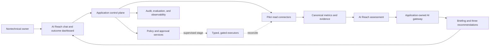
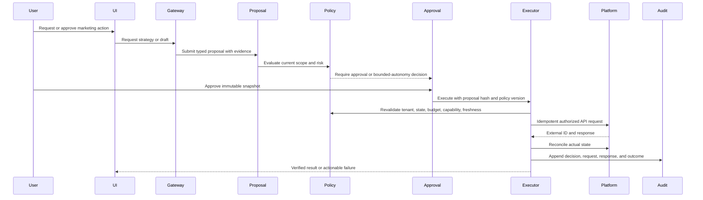

# System Architecture

## Architectural objective

Build a multi-tenant marketing operating system that turns plain-language goals into measured, supervised work.

The pilot proves one narrow outcome loop before broad platform execution. One supervisor uses typed read and proposal tools through an application-owned AI gateway.

The application remains the authority for identity, data, metrics, policy, approval, execution, audit, and recovery.

## Current implementation boundary

The repository currently implements the Next.js control plane, onboarding, identity, and Account Connections work.

AI Reach, canonical marketing outcomes, advertising insights, CRM outcomes, supervised actions, Hermes, Temporal, and broad publishing remain target work.

Documentation status never substitutes for implementation and target-environment evidence.

## Context diagram

## Core boundaries

### Experience plane

- Next.js web application and authenticated APIs.
- AI Reach chat, one outcome dashboard, Work, Decisions, Connections, and Settings.
- Campaign builders, broad content calendars, deep analytics, and agency views are expansion surfaces.
- No browser-held platform secrets beyond short-lived secure authorization handoffs.

### Control plane

- Organizations, users, roles, policies, capability registry, proposals, approvals, executions, and audit.
- Final authority for every action.
- Performs tenant, resource, policy, budget, freshness, and capability validation.
- Exposes typed tools through the application-owned AI gateway; never exposes a general database or shell mutation tool.

### Intelligence plane

- One versioned supervisor profile behind an application-owned, replaceable gateway for the pilot.
- Versioned instructions, tools, evidence rules, model settings, and evaluation suites.
- Research, interpretation, strategy, drafting, and recommendation.
- Produces artifacts and proposals but does not own authoritative application state.
- Hermes and separate specialist profiles remain trigger-based expansion components behind the same contract.

### Workflow plane

- Durable jobs for connector sync, website crawl, AI Reach samples, briefing refresh, approval, execution, retry, and reconciliation.
- The pilot can use application-owned database state, an outbox, and bounded scheduled jobs.
- Temporal remains a later option when measured workflow complexity or reliability needs justify it.
- Deterministic timers and scripts do not invoke a model unnecessarily.

### Data plane

- PostgreSQL as the initial transactional and canonical analytical store.
- Prisma for database access and migrations.
- Raw connector payloads in append-only object storage plus normalized references in PostgreSQL.
- S3-compatible object storage for creative, documents, exports, and evidence snapshots.
- Optional ClickHouse or existing warehouse only after measured volume/latency requires it.

### Integration plane

- Pilot connectors: website/CMS, GA4, Search Console, Google Ads, Meta Ads, and one selected CRM.
- Conditional pilot connectors: calendar and email when needed for outcome evidence.
- AI Reach observation adapters with labeled provider, method, version, locale, time, and limitations.
- Other paid, organic, commerce, publishing, and asset adapters are expansion work.
- Official APIs or authorized providers; no access-control circumvention.

### Trust plane

- Managed or operator-controlled secrets and key management appropriate to the deployment plane.
- Authentication, authorization, tenant isolation, policy, consent/provenance, audit, threat detection, and incident controls.
- Separate read and mutation principals where the platform supports them.

## Initial deployment shape

Start with the current modular Next.js control plane and managed data services:

- `web`: Next.js UI and server endpoints.
- `api`: application services if separated from the web runtime.
- `jobs`: bounded connector, crawl, observation, briefing, notification, and reconciliation jobs.
- `ai-gateway`: application-owned provider adapter and typed tool boundary.
- `postgres`: transactional/canonical data.
- `object-store`: raw payloads and creative artifacts.
- `telemetry`: vendor-neutral application events, metrics, and traces.

Separate workers, Hermes, Temporal, Postiz, Coolify, and a collector are later deployment options. Each needs a recorded trigger.

Module boundaries must be enforced in code even when initially deployed together. Agents and connectors must not import database internals across module boundaries.

## Application modules

| Module | Owns | Does not own |
|---|---|---|
| Identity and tenancy | organizations, memberships, roles, sessions | platform permissions |
| Business context | offers, audiences, brand, goals, claims, corrections | raw agent memory |
| Conversations | threads, messages, evidence links, proposal links | canonical business state |
| Briefings | saved outcome summaries and three ranked recommendations | metric calculations |
| Connections | OAuth grants, account mapping, capabilities, health | campaign strategy |
| Connector evidence | sync runs, immutable evidence references, collection metadata | metric interpretation |
| AI Reach | question sets, observations, citations, factual assessments, discovery findings | business truth, content drafts, or authorization |
| Website content | page snapshots, source briefs, draft versions, CMS draft receipts | public publication authority |
| Lead follow-up | minimized lead references, drafts, consent evidence, delivery receipts | CRM source records |
| Campaigns | briefs, cross-channel plans, platform drafts, state projections | unrestricted platform writes |
| Content | source briefs, variants, calendar, publication records | permission decisions |
| Creative | asset metadata, provenance, rights, transformations, reviews | opaque generated files without lineage |
| Metrics | definitions, observations, quality, aggregates | model-only calculations |
| Opportunities | tactics, experiments, evidence, decisions | silent promotion to production |
| Proposals | immutable proposed changes and dependencies | final authorization |
| Approvals | decisions bound to proposal hashes | execution implementation |
| Policy | risk classification, legal/platform gates, budgets, autonomy | agent discretion |
| Execution | typed connector mutations, idempotency, reconciliation | strategy generation |
| Agents | runs, tasks, skills, artifacts, evidence | authoritative business state |
| Audit | append-only event history | editable operational records |

## Write path

The first useful release does not use this path and has no external mutation principal.

The pilot MVP enables only CMS draft creation, approved lead follow-up, and one campaign pause with a resume path.

## Read and analysis path

1. Read connectors store raw evidence and request metadata.
2. Normalizers create tenant-scoped entities and observations.
3. AI Reach stores labeled website, answer, citation, and factual observations.
4. Data-quality services calculate freshness, completeness, duplication, and reconciliation status.
5. Metric services create a versioned outcome snapshot.
6. The supervisor receives only authorized, scoped tool results with evidence references.
7. The briefing stores the exact evidence, definitions, and three selected recommendations.

## Multi-tenancy

- Every primary table contains `organization_id` unless it is global reference data.
- Repository/service methods require an explicit organization context.
- Database-level row security should provide defense in depth where practical.
- Object-storage keys are tenant-prefixed and access is mediated by short-lived signed URLs.
- Queue/workflow payloads carry opaque IDs, not raw secrets.
- Agent sessions, workspaces, memory, and files are isolated per organization and role.
- Shared skill templates are immutable inputs; organization-specific configuration is separately stored.

## State machines

### Proposal

`draft -> validated -> awaiting_approval -> approved | rejected | expired -> executing -> reconciled | failed | uncertain -> rolled_back`

### Organic publication

`idea -> brief -> drafting -> review -> approved -> scheduled -> publishing -> published | failed | uncertain -> canceled`

### Experiment

`draft -> design_review -> approved -> running -> stopped -> analyzing -> concluded -> adopted | inconclusive | rejected`

### AI Reach observation run

`scheduled -> collecting -> normalizing -> assessing -> completed | partial | failed`

### Website draft

`opportunity -> brief -> drafting -> validating -> awaiting_approval -> cms_draft_created -> reviewed -> published | rejected | expired`

### Lead follow-up

`draft -> eligibility_check -> awaiting_approval -> approved -> sending -> delivered | failed | uncertain | canceled`

The read-only release stops before every mutation state.

Transitions occur through domain services and append audit events. Direct status edits are prohibited.

## Failure rules

- Unknown external result: reconcile before retry.
- Stale evidence or changed destination: invalidate approval.
- Partial multi-platform launch: preserve successful actions, stop dependent actions, and present compensating options.
- Model unavailable: deterministic monitoring continues; queued agent tasks degrade visibly.
- Metric quality failure: block optimization but continue ingestion and alerting.
- Policy service unavailable: fail closed for mutations.
- Audit write unavailable: do not perform a mutation.
- Notification failure: preserve the approval or execution state and retry notification independently.

## Initial technology defaults

- TypeScript strict mode across application services.
- Next.js for the web application.
- Zod at API, event, tool, and connector boundaries.
- PostgreSQL with Prisma.
- Application-owned job state and outbox patterns for the narrow pilot; Temporal remains behind a later workflow abstraction.
- Supabase Storage initially and S3-compatible object storage behind an application-owned storage contract.
- An application-owned AI gateway and one supervisor profile; Hermes remains compatible with the stable adapter contract.
- OpenTelemetry for tracing and metrics.
- OpenAI as the managed model provider and Resend as the managed transactional email provider.
- Vercel for the client-facing Next.js application and managed Supabase for initial PostgreSQL, Auth, and Storage.
- Trigger-based deployment definitions for Hermes, Temporal, Postiz, Coolify, workers, and the OpenTelemetry collector.
- Stripe is the post-pilot payment candidate behind an application-owned billing boundary.
- Managed secrets for Vercel/Supabase and an encrypted, access-controlled secret store for the self-hosted automation plane; AWS Secrets Manager/KMS applies when AWS is provisioned.
- REST/JSON for public application APIs initially; internal events use versioned schemas.

These are defaults, not permission to couple domain contracts to a vendor.

## Hosting and service-delivery model

The initial pooled service uses Vercel for the client-facing application and managed Supabase for PostgreSQL, Auth, and Storage. OpenAI and Resend remain managed.

GitHub and Sentry can remain managed when their limits meet environment requirements. Stripe can remain managed after billing is enabled.

The pilot does not provision a separate self-hosted automation plane by default. A service is added only after a recorded reliability, capacity, compliance, cost, or workflow trigger.

AWS is the scale, compliance, and dedicated-deployment target. It is provisioned when measured traffic, isolation, residency, SLO, or enterprise requirements justify it, rather than duplicated alongside the initial services by default. Higher-isolation clients may purchase an operator-owned or client-owned AWS deployment. An outbound-only client-site connector is available only for approved local/private integrations and never owns canonical state, authorization, approvals, or audit.

Infrastructure remains reproducible and vendor-specific details stay behind application-owned contracts. See [Cloud Hosting and Service Delivery](cloud-hosting-and-service-delivery.md), [Hermes Multi-Agent Architecture](hermes-multi-agent-architecture.md), and [Agent Gateway and Orchestration Boundary](agent-orchestration-architecture.md).
