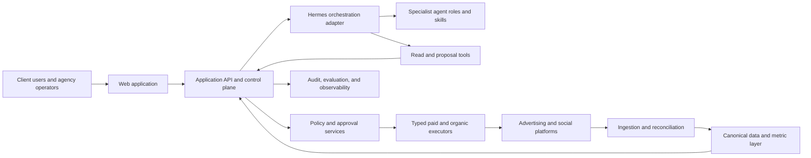
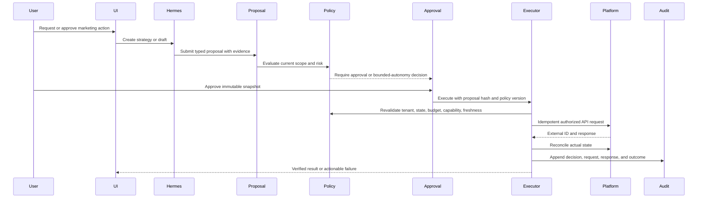

# System Architecture

## Architectural objective

Build a multi-tenant, multiplatform marketing operating system in which Hermes and specialist agents can reason broadly but can act only through narrow, typed, policy-controlled application services.

## Context diagram

## Core boundaries

### Experience plane

- Next.js web application and authenticated APIs.
- Onboarding, command center, campaigns, content, approvals, analytics, knowledge, and settings.
- No browser-held platform secrets beyond short-lived secure authorization handoffs.

### Control plane

- Organizations, users, roles, policies, capability registry, proposals, approvals, executions, and audit.
- Final authority for every action.
- Performs tenant, resource, policy, budget, freshness, and capability validation.
- Exposes typed tools to Hermes; never exposes a general database or shell mutation tool.

### Intelligence plane

- Hermes orchestration adapter.
- Versioned specialist profiles, skills, prompts, and evaluation suites.
- Research, interpretation, strategy, drafting, and recommendation.
- Produces artifacts and proposals but does not own authoritative application state.

### Workflow plane

- Durable orchestration for syncs, approvals, scheduled publications, campaign execution, retries, reconciliation, and long-running agent tasks.
- Recommended default: Temporal for durable workflows; preserve an abstraction if an equivalent service is selected.
- Deterministic timers and scripts do not invoke a model unnecessarily.

### Data plane

- PostgreSQL as the initial transactional and canonical analytical store.
- Prisma for database access and migrations.
- Raw connector payloads in append-only object storage plus normalized references in PostgreSQL.
- S3-compatible object storage for creative, documents, exports, and evidence snapshots.
- Optional ClickHouse or existing warehouse only after measured volume/latency requires it.

### Integration plane

- Paid connectors: Meta, Google, Microsoft, LinkedIn, TikTok, Reddit, and X.
- Organic connectors: LinkedIn, X, Instagram, TikTok, Facebook, YouTube, and Reddit.
- CRM, commerce, analytics, billing, email/notification, and asset-provider adapters.
- Official APIs or authorized providers; no access-control circumvention.

### Trust plane

- Managed secrets and key management.
- Authentication, authorization, tenant isolation, policy, consent/provenance, audit, threat detection, and incident controls.
- Separate read and mutation principals where the platform supports them.

## Recommended deployment shape

Start as a modular monolith with independently deployable workers:

- `web`: Next.js UI and server endpoints.
- `api`: application services if separated from the web runtime.
- `worker`: Temporal activities, connectors, publishing, reconciliation, and notifications.
- `hermes-gateway`: isolated adapter process that brokers Hermes runs and tool calls.
- `postgres`: transactional/canonical data.
- `object-store`: raw payloads and creative artifacts.
- `temporal`: durable workflow state.
- `otel-collector`: traces, metrics, and logs.

Module boundaries must be enforced in code even when initially deployed together. Agents and connectors must not import database internals across module boundaries.

## Application modules

| Module | Owns | Does not own |
|---|---|---|
| Identity and tenancy | organizations, memberships, roles, sessions | platform permissions |
| Business context | offers, audiences, brand, goals, claims, corrections | raw agent memory |
| Connections | OAuth grants, account mapping, capabilities, health | campaign strategy |
| Campaigns | briefs, cross-channel plans, platform drafts, state projections | unrestricted platform writes |
| Content | source briefs, variants, calendar, publication records | permission decisions |
| Creative | asset metadata, provenance, rights, transformations, reviews | opaque generated files without lineage |
| Metrics | definitions, observations, quality, aggregates | model-only calculations |
| Opportunities | tactics, experiments, evidence, decisions | silent promotion to production |
| Proposals | immutable proposed changes and dependencies | final authorization |
| Approvals | decisions bound to proposal hashes | execution implementation |
| Policy | risk classification, legal/platform gates, budgets, autonomy | agent discretion |
| Execution | typed connector mutations, idempotency, reconciliation | strategy generation |
| Agents | runs, tasks, skills, artifacts, evidence | authoritative business state |
| Audit | append-only event history | editable operational records |

## Write path

## Read and analysis path

1. Connector records raw response and request metadata.
2. Normalizer maps platform data into canonical entities and observations.
3. Data-quality service calculates freshness, completeness, duplication, and reconciliation status.
4. Semantic metric service computes versioned business metrics.
5. Hermes receives only authorized, scoped tool results with evidence references.
6. Recommendations preserve the exact metric snapshot and definitions used.

## Multi-tenancy

- Every primary table contains `organization_id` unless it is global reference data.
- Repository/service methods require an explicit organization context.
- Database-level row security should provide defense in depth where practical.
- Object-storage keys are tenant-prefixed and access is mediated by short-lived signed URLs.
- Queue/workflow payloads carry opaque IDs, not raw secrets.
- Hermes sessions, workspaces, memory, and files are isolated per organization and role.
- Shared skill templates are immutable inputs; organization-specific configuration is separately stored.

## State machines

### Proposal

`draft -> validated -> awaiting_approval -> approved | rejected | expired -> executing -> reconciled | failed | uncertain -> rolled_back`

### Organic publication

`idea -> brief -> drafting -> review -> approved -> scheduled -> publishing -> published | failed | uncertain -> canceled`

### Experiment

`draft -> design_review -> approved -> running -> stopped -> analyzing -> concluded -> adopted | inconclusive | rejected`

Transitions occur through domain services and append audit events. Direct status edits are prohibited.

## Failure rules

- Unknown external result: reconcile before retry.
- Stale evidence or changed destination: invalidate approval.
- Partial multi-platform launch: preserve successful actions, stop dependent actions, and present compensating options.
- Model unavailable: deterministic monitoring continues; queued agent tasks degrade visibly.
- Metric quality failure: block optimization but continue ingestion and alerting.
- Policy service unavailable: fail closed for mutations.
- Audit write unavailable: do not perform a mutation.
- Notification failure: preserve the approval or execution state and retry notification independently.

## Initial technology defaults

- TypeScript strict mode across application services.
- Next.js for the web application.
- Zod at API, event, tool, and connector boundaries.
- PostgreSQL with Prisma.
- Temporal for durable workflows.
- S3-compatible object storage.
- Hermes behind an application-owned gateway.
- OpenTelemetry for tracing and metrics.
- Managed secrets and KMS from the selected cloud.
- REST/JSON for public application APIs initially; internal events use versioned schemas.

These are defaults, not permission to couple domain contracts to a vendor.

