# Creative and Content Pipeline

## Objective

Create useful marketing content without losing factual grounding, originality, brand consistency, rights provenance, human control, or outcome traceability.

The pilot focuses on website drafts that close an AI Reach or conversion gap. The first complete workflow adds content and creative support in draft mode for the same offer: landing-page drafts, ad copy variants, and creative briefs for the campaign package (D-043, accepted). Broad social asset production is expansion work.

## Draft mode and batch size

- Content and creative support never publishes. Outputs are drafts, variants, and briefs attached to a campaign package or a website draft.
- The useful unit is the concept and its business hypothesis. Generate a batch that the available test budget and conversion maturity can evaluate. Do not generate hundreds of minor variations by default.
- The pipeline must scale to volume when the budget allows it. Volume is a capability, not a default.
- Every generated asset passes the validation gates below before it reaches a proposal. A vision or text review step checks brand rules, claim rules, and legibility; failures produce remediation, never silent removal.
- Creative support reads the creative history before generating: exhausted angles, rejected formats, and winning hooks are known inputs.
- New angles enter through approved first-party material (interviews, sales calls, reviews) and the weekly research task (competitor public messaging, transcripts, trends collected through permitted means). Repetition is measured, not assumed.

## Pipeline

```mermaid
flowchart LR
    R["Research and first-party evidence"] --> B["Approved source brief"]
    B --> C["Concept generation"]
    C --> J["Concept judging and selection"]
    J --> A["Copy and asset production"]
    A --> V["Factual, brand, rights, policy, and technical validation"]
    V --> P["Platform-native variants and previews"]
    P --> H["Human approval"]
    H --> D["Paid launch or organic publication"]
    D --> M["Outcome measurement"]
    M --> L["Learning and next experiment"]
```



## Research package

May include:

- customer interviews and sales calls;
- CRM objections and qualification outcomes;
- product and offer evidence;
- approved testimonials;
- competitor public messaging and ad libraries;
- search/query and content-performance data;
- current trend or community evidence collected through permitted means.

Every item records source, date, trust class, rights, and applicable organization.

## Website and AI Reach content

Pilot inputs can include:

- approved sales-trainer expertise and first-hand examples;
- existing website pages;
- Search Console demand;
- GA4 landing-page outcomes;
- AI Reach answer and citation samples;
- CRM objections and qualification outcomes;
- approved claims, testimonials, offer details, and source evidence.

The workflow is:

```text
AI Reach finding
  -> opportunity
  -> source brief
  -> website draft
  -> factual, brand, search, and policy validation
  -> approval
  -> CMS draft
  -> subject review
  -> later publication approval
  -> reobservation
```

AI Reach owns the finding. The content domain owns the draft. The control plane owns approval and execution.

## Concept contract

- Target audience and stage.
- Problem or desire.
- Angle and hook.
- Core message and proof.
- Offer and call to action.
- Intended formats/platforms.
- Hypothesis and expected behavior change.
- Differentiation from active concepts.
- Risk and claim markers.

## Multi-agent creative tournament — expansion

For important campaigns, multiple bounded creative roles may generate alternatives. A separate reviewer compares them using an explicit rubric:

- factual support;
- audience relevance;
- offer/message match;
- clarity and specificity;
- brand fit;
- platform nativeness;
- novelty versus current library;
- policy and rights risk;
- testability.

The reviewer does not declare likely performance with certainty. Human selection and market results remain authoritative.

## Asset production

Supported asset classes include text, image, carousel/document, short video, long video package, audio/voice where licensed, thumbnail, captions, transcript, and landing-page brief.

Every generated asset stores:

- source brief and concept;
- generator/model/tool and version;
- input assets and transformations;
- checksum and technical metadata;
- rights and consent status;
- review and approval state;
- all platform variants using it;
- performance linkage.

## Validation gates

### Factual

- Claims match approved claim records and evidence.
- Numbers, prices, availability, and dates are current.
- Quotes/testimonials have permission and exact attribution.

### Brand

- Voice, prohibited terms, visual standards, and accessibility.
- No unapproved impersonation or invented customer experience.

### Rights

- Ownership/license for source and generated assets.
- Likeness, voice, music, logo, and testimonial consent.
- Retention and territory restrictions.

### Platform and legal

- Current technical and content constraints.
- Required disclosures and restricted categories.
- Sensitive targeting/claim escalation.

### Technical

- File type, dimensions, aspect ratio, duration, codec, size, safe zones, captions, and alt text.

### Website and discovery

- Content gives material value to a human reader.
- Search intent matches the page purpose.
- Claims and citations match approved evidence.
- Canonical and index directives match the intended state.
- Structured data matches visible page content.
- Duplicate, thin, generic, and scaled low-value content is blocked.
- The page stays accessible and usable.
- The draft makes no ranking, citation, recommendation, or revenue promise.

Failures produce explicit remediation; they are never silently removed from a creative.

## Editing and versioning

- Manual edits create a new version and take precedence over prior generated text.
- Regeneration cannot overwrite a human-edited sibling variant.
- Approved versions are immutable.
- Reuse creates a derivative with lineage, not a disconnected copy.
- Corrections can be promoted to business context or skill eval cases.
- Page body, title, metadata, structured data, internal links, human edits, CMS draft, and published snapshot keep separate versions.

## Creative performance model

Store performance at concept, asset, variant, platform, audience, placement, and time-window levels. Avoid attributing performance to copy alone when delivery, targeting, offer, landing page, or measurement changed.

Every asset keeps its full lineage: pain point, angle, hook, format, generation inputs, brand-filter result, platform, audience, and performance by window (creative history, D-047). Do not promote a winner from one click, one lead, or a short unstable window.

Creative fatigue detection uses deterministic thresholds and uncertainty, including frequency/exposure, declining qualified outcome rate, spend, age, audience size, and comparative variants. The agent explains likely causes and proposes refresh experiments.

## Paid-organic learning loop

- Strong organic concepts may become paid experiments after a new approval.
- Strong paid concepts may inspire organic variants without copying an ad verbatim.
- Shared source briefs and concept IDs permit cross-channel learning.
- Each channel keeps separate execution, approval, and measurement.
